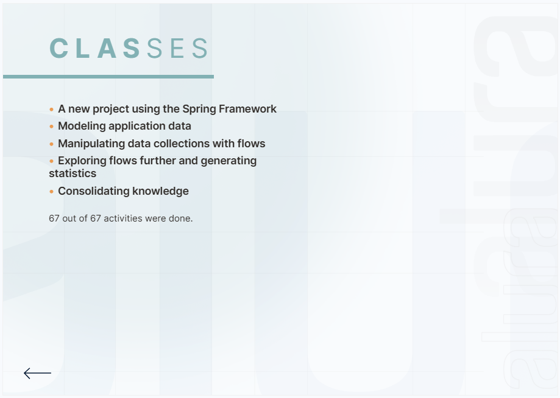

# Alura - ONE Oracle Next Education T6
## Curso de Java Web e banco de dados
|  |
|:---:|
| Curso ONE Oracle Next Education T6, uma parceria entre a Oracle e a Alura, onde estou me dedicando ao aprendizado de Java Web e banco de dados|

<a href="https://spring.io/"></a>
<a href="https://docs.oracle.com/en/java/javase/20/"></a>

## Índice
<a id="topo"></a>

- [Apresentação](#apresentacao)
- [Instrutores](#instrutor)
- [Um novo projeto utilizando o Spring Framework](#start-spring)
    - [Consumindo dados de séries](#consumindo-series)
    - [Desserializando dados](#desserializando-dados)
    - [Modelando dados da série](#modelando-dados-serie)
- [Modelando os dados da aplicação](#modelando-dados-aplicacao)
    - [Modelando episódios](#modelando-episodios)
    - [Modelando temporadas](#modelando-temporadas)
    - [Criando o menu de interação com o usuário](#menu-interacao)
    - [Buscando dados completos da série](#buscando-dados-completos)
    - [Trabalhando na coleção de dados](#trabalhando-colecao)
- [Manipulando com fluxos as coleções de dados](#manipulando-fluxos-colecoes-dados)
    - [Encadeando operações com streams](#encadeando-operacoes-streams)
    - [Identificando os top 5 melhores episódios](#identificando-top-5-episodios)
    - [Uma nova classe para lidar com os dados do episódio](#nova-classe-dados-episodio)
    - [Buscando episódios a partir de uma data](#buscando-episodios-data)
- [Explorando mais os fluxos e gerando estatísticas](#explorando-fluxos-gerando-estatisticas)
    - [Exibindo as etapas de uma stream](#exibindo-etapas-stream)
    - [Encontrando a primeira ocorrência de uma busca a uma coleção](#encontrando-primeira-ocorrencia)
    - [Criando um mapa com dados por temporada](#criando-mapa-dados-temporada)
    - [Coletando estatísticas](#coletando-estatisticas)
- [Conclusão](#conclusao)
- [Certificados](#certificados)
- [Licença](#licenca)

## <a name="apresentacao"> Apresentação </a>

Este repositório contém os códigos desenvolvidos durante o curso de Java Web e banco de dados, ministrado pela Alura, no programa ONE Oracle Next Education T6.

Oi! Vou compartilhar com você a minha experiência e as práticas que aprendi durante o curso de Spring Boot API que fiz recentemente.

Primeiramente, devo dizer que adorei a forma como o curso foi estruturado e conduzido pela Jacqueline Oliveira e pela Iasmin Araújo. A Jacqueline, com sua vasta experiência como engenheira de software, e a Iasmin, sempre animada e prestativa, tornaram o aprendizado muito envolvente.

Para participar do curso, era fundamental já ter uma base sólida em Java com Orientação a Objetos, o que ajudou muito a entender os novos recursos que fomos introduzidos.

Durante o curso, desenvolvemos um projeto utilizando Spring Boot, o que foi uma experiência incrível. Aprendi a adicionar e gerenciar dependências no projeto usando Maven, incluindo bibliotecas como o Jackson para manipulação de dados JSON.

Exploramos profundamente as funções lambda e a API de streams do Java. Essas ferramentas foram essenciais para realizar operações complexas com coleções e manipular dados de maneira eficiente e elegante. Também revisitamos conceitos importantes como interfaces, generics, e a API de datas do Java, consolidando ainda mais o meu conhecimento.

Utilizamos a Screen Match, uma aplicação de streaming de filmes e séries, para aplicar os conceitos aprendidos. Trabalhar especificamente com a parte de séries, considerando temporadas e episódios, foi desafiador e muito enriquecedor para entender melhor o uso de coleções no Java.

Ao final do curso, enfrentamos diversos desafios que nos permitiram aplicar tudo o que aprendemos de maneira prática. Foi uma ótima forma de consolidar o conhecimento adquirido.

Além dos vídeos e atividades, também tive acesso a outros recursos na plataforma, como podcasts, o Fórum e o canal no Discord, o que me ajudou a tirar dúvidas e interagir com outros alunos.

Foi uma experiência muito gratificante e estou ansioso para aplicar todas essas novas habilidades nos meus projetos futuros!

<p align="right">
  <a href="#topo" style="text-decoration: none; background-color: #007bff; color: white; padding: 10px 20px; border-radius: 5px;">Voltar ao Topo</a>
</p>

## <a name="instrutor"> Instrutores </a>

- [Iasmin Araújo](https://github.com/iasminaraujoc) - Curso graduação em Ciência da Computação na UFMG. Faço parte do Scuba Team da Escola de Programação e aqui no fórum estarei principalmente nos tópicos de Java. No tempo livre, gosto de estudar sobre neurociência e fazer musculação.

- [Jacqueline Oliveira](https://github.com/jacqueline-oliveira) - Engenheira de Software, formada em Ciência da Computação e pós-graduada em Arquitetura e Engenharia de Software, atua como desenvolvedora backend Java desde 2010.

<p align="right">
  <a href="#topo" style="text-decoration: none; background-color: #007bff; color: white; padding: 10px 20px; border-radius: 5px;">Voltar ao Topo</a>
</p>


## <a name="start-spring"> Um novo projeto utilizando o Spring Framework </a>

Começamos configurando um projeto Spring Boot usando o Spring Initializr. Escolhemos o Maven como gerenciador de dependências e a linguagem Java na versão mais recente disponível. Aqui estão as configurações que usei:

```yaml

Group: br.com.alura
Artifact: screenmatch
Name: screenmatch
Description: Primeiro projeto Spring sem web
Package name: br.com.alura.screenmatch
Packaging: Jar
Java: 17
```
Após gerar o projeto, fiz o download do arquivo screenmatch.zip, que continha a estrutura básica do projeto Maven. Abrindo o projeto no IntelliJ, visualizei a estrutura de pastas e o arquivo pom.xml.

    - Estrutura do Projeto
A estrutura inicial do projeto consistia em pastas para Source, Main, Java, além de uma pasta principal com o nome completo da aplicação e uma parte de testes. O arquivo ScreenmatchApplication.java continha a classe principal com o método public static void main, ponto de entrada da aplicação.

```java

public static void main(String[] args) {
    SpringApplication.run(ScreenmatchApplication.class, args);
}
```

Executamos a aplicação pela primeira vez para ver se tudo estava funcionando. O terminal exibiu o log do Spring Boot indicando que a aplicação foi iniciada corretamente.

    - Implementação do CommandLineRunner
Para transformar a aplicação em uma linha de comando, implementamos a interface CommandLineRunner na classe principal. Isso permitiu realizar chamadas no método run, similar ao método main que já conhecíamos.

```java

@SpringBootApplication
public class ScreenmatchApplication implements CommandLineRunner {

    public static void main(String[] args) {
        SpringApplication.run(ScreenmatchApplication.class, args);
    }

    @Override
    public void run(String... args) throws Exception {
        System.out.println("Primeiro projeto Spring sem web.");
    }
}
```

Executamos novamente a aplicação e verificamos no terminal a mensagem "Primeiro projeto Spring sem web.".

    - Próximos Passos
O próximo passo é modelar a aplicação para consumir séries, trabalhar com listas e coleções de temporadas e episódios, aumentando o escopo do projeto. Fiquei animado para ver como podemos expandir essa aplicação básica e integrá-la com dados mais complexos, usando todo o poder do Spring.

Essa experiência foi muito enriquecedora e estou ansioso para aplicar o que aprendi em projetos futuros. Até lá, continuarei explorando mais sobre Spring e suas capacidades.

<p align="right">
  <a href="#topo" style="text-decoration: none; background-color: #007bff; color: white; padding: 10px 20px; border-radius: 5px;">Voltar ao Topo</a>
</p>

<details>
  <summary> Para saber mais: entendendo Maven e Gradle </summary>

Minha jornada no curso sobre Maven e Gradle foi enriquecedora, proporcionando uma compreensão detalhada dessas ferramentas essenciais no desenvolvimento Java.

    • Maven: Simplicidade e Convenção

Com o Maven, mergulhei nos principais conceitos, como gerenciamento de dependências, ciclo de vida padrão e o repositório central. A simplicidade de declarar dependências no `pom.xml` e deixar o Maven cuidar do resto foi impressionante. O ciclo de vida padrão simplificou as tarefas de compilação, teste e empacotamento do projeto. Além disso, o amplo repositório central do Maven ofereceu uma vasta gama de bibliotecas prontas para uso.

    • Gradle: Flexibilidade e Personalização

Explorando o Gradle, descobri sua flexibilidade e poder de personalização. Sua DSL baseada em Groovy ou Kotlin permitiu definir a estrutura do projeto e as tarefas de construção de forma altamente flexível. Adorei a capacidade de criar compilações incrementais, o que tornou o processo mais rápido e eficiente.

    • Semelhanças e Diferenças

Ambas as ferramentas fornecem convenções para estrutura de diretórios, gerenciamento de dependências e plugins de construção. A principal diferença reside na maneira como gerenciam dependências e descrevem a lógica de construção. Maven usa arquivos XML e plugins, enquanto o Gradle usa scripts de construção como código.

    • Vantagens e Desvantagens

O Maven é conhecido por sua facilidade de aprendizado e grande ecossistema, mas seus arquivos XML podem se tornar complicados em projetos complexos. Já o Gradle oferece scripts de construção mais poderosos e é mais flexível, porém possui uma curva de aprendizado mais íngreme e um ecossistema menos desenvolvido.

    • Escolha e Contexto

A escolha entre Maven e Gradle depende do projeto e das preferências da equipe. O Maven é ideal para projetos menores e mais simples, enquanto o Gradle brilha em projetos maiores e mais complexos que requerem personalização específica.

Em resumo, ambos são poderosos e amplamente utilizados, e a escolha dependerá do contexto e das necessidades do projeto.

<p align="right">
  <a href="#topo" style="text-decoration: none; background-color: #007bff; color: white; padding: 10px 20px; border-radius: 5px;">Voltar ao Topo</a>
</p>

</details>


<details>
  <summary> Para saber mais: a interface CommandLineRunner </summary>

Aprendi como essa ferramenta é poderosa e amplamente utilizada no desenvolvimento de aplicações Java, especialmente em projetos Spring Boot.

Entendendo a Funcionalidade
A interface CommandLineRunner permite executar ações logo após a inicialização de uma aplicação Spring Boot. Isso é extremamente útil para realizar tarefas como carregar dados no banco de dados assim que a aplicação é iniciada.

Implementação na Prática
A utilização da interface é bastante simples. Basta implementá-la na classe principal da aplicação e definir a lógica a ser executada no método run. Aqui está um exemplo prático:

```java
    @SpringBootApplication
    public class MyCommandLineRunner implements CommandLineRunner {
    
    @Override
    public void run(String... args) throws Exception {
        System.out.println("Olá, Mundo!");
    }
    }
```
Nesse exemplo, criamos uma classe MyCommandLineRunner que implementa a interface CommandLineRunner. No método run, especificamos a ação desejada, que neste caso é apenas imprimir "Olá, Mundo!".

    • Versatilidade de Uso
A CommandLineRunner pode ser aplicada em uma variedade de situações. Além de carregar dados para o banco de dados, pode-se usar para iniciar recursos, como conexões de rede, e para verificar a integridade de componentes ou serviços.

    • Motivação e Aprofundamento
Aprendi que a CommandLineRunner é uma ferramenta valiosa para otimizar o processo de inicialização da aplicação e simplificar tarefas complexas. Isso pode ser especialmente útil em cenários onde há necessidade de carregar grandes volumes de dados no banco de dados logo no início da execução da aplicação.

Ao aprofundar meu conhecimento no Spring, descobri que há uma infinidade de ferramentas e recursos disponíveis para tornar meu código mais eficiente e limpo. O Spring facilita o desenvolvimento de aplicações em Java, fornecendo um modelo de programação abrangente e simplificado.

Em resumo, o curso me proporcionou uma compreensão mais profunda do Spring Framework e como utilizar suas ferramentas para desenvolver aplicações Java de forma eficaz.

<p align="right">
  <a href="#topo" style="text-decoration: none; background-color: #007bff; color: white; padding: 10px 20px; border-radius: 5px;">Voltar ao Topo</a>
</p>

</details>

<details>
  <summary> Código para consumir API </summary>

Minha experiência no curso incluiu a criação de uma classe chamada ConsumoAPI, onde implementamos um método chamado obterDados para consumir uma API de busca de dados de séries. Essa classe foi organizada dentro do pacote service.

O método obterDados é responsável por enviar uma requisição HTTP para o endereço especificado e retornar a resposta em formato JSON como uma string. Esse procedimento foi muito similar ao que aprendemos no curso anterior da formação Java com Orientação a Objetos.

Aqui está o código do método obterDados, que você pode facilmente copiar e colar em sua classe para acelerar seus estudos:

```java
public String obterDados(String endereco) {
    HttpClient client = HttpClient.newHttpClient();
    HttpRequest request = HttpRequest.newBuilder()
            .uri(URI.create(endereco))
            .build();
    HttpResponse<String> response = null;
    try {
        response = client
                .send(request, HttpResponse.BodyHandlers.ofString());
    } catch (IOException e) {
        throw new RuntimeException(e);
    } catch (InterruptedException e) {
        throw new RuntimeException(e);
    }

    String json = response.body();
    return json;
}
```

Esse método é uma maneira eficiente de consumir APIs e obter dados de forma rápida e fácil. A partir daqui, podemos manipular os dados recebidos e utilizá-los em nossa aplicação.

<p align="right">
  <a href="#topo" style="text-decoration: none; background-color: #007bff; color: white; padding: 10px 20px; border-radius: 5px;">Voltar ao Topo</a>
</p>

</details>

## <a name="consumindo-series"> Consumindo dados de séries </a>

Durante o curso, tive a oportunidade de aprender a consumir uma API usando o Spring Framework, o que me permitiu entender melhor como integrar serviços externos em minhas aplicações Java. A experiência começou com a criação de um pacote de serviços chamado service e a implementação de uma classe chamada ConsumoApi para fazer as requisições e obter respostas em formato JSON.

Aqui está um resumo das etapas que segui e das práticas que aprendi:

        - Criando o Pacote de Serviços
Primeiramente, criei um pacote de serviços chamado service no projeto br.com.alura.screenmatch. No IntelliJ, isso foi feito clicando com o botão direito no diretório br.com.alura.screenmatch, selecionando "New > Package" e nomeando-o de service.

Implementando a Classe ConsumoApi
Dentro do pacote service, criei uma nova classe Java chamada ConsumoApi. O objetivo dessa classe era consumir uma API e obter dados JSON. O método principal dessa classe, obterDados, foi implementado para enviar uma requisição HTTP e retornar a resposta como uma string JSON. Aqui está o código:

```java
package br.com.alura.screenmatch.service;

import java.io.IOException;
import java.net.URI;
import java.net.http.HttpClient;
import java.net.http.HttpRequest;
import java.net.http.HttpResponse;

public class ConsumoApi {

    public String obterDados(String endereco) {
        HttpClient client = HttpClient.newHttpClient();
        HttpRequest request = HttpRequest.newBuilder()
                .uri(URI.create(endereco))
                .build();
        HttpResponse<String> response = null;
        try {
            response = client
                    .send(request, HttpResponse.BodyHandlers.ofString());
        } catch (IOException e) {
            throw new RuntimeException(e);
        } catch (InterruptedException e) {
            throw new RuntimeException(e);
        }

        String json = response.body();
        return json;
    }
}
```
Consumindo Dados de Séries
Para consumir dados de séries usando a API, utilizei a classe principal da aplicação. A ideia era acessar o método run e chamar a classe ConsumoApi. Isso modularizou nosso código, tornando-o mais fácil de manter e mais legível.

No método run, instanciei a classe ConsumoApi e chamei o método obterDados com a URL da API, passando a chave de API como parâmetro. Aqui está como ficou:
    
```java
    @Override
    public void run(String... args) throws Exception {
    var consumoApi = new ConsumoApi();
    var json = consumoApi.obterDados("https://www.omdbapi.com/?t=gilmore+girls&apikey=keyAPI");
    System.out.println(json);
}
```	

Testando com Diferentes APIs
Foi interessante ver como a classe ConsumoApi poderia ser reutilizada para consumir diferentes APIs. Por exemplo, além de obter dados de séries, testei a classe com uma API que retorna imagens de café:

```java
    @Override
    public void run(String... args) throws Exception {
    var consumoApi = new ConsumoApi();
    var json = consumoApi.obterDados("https://www.omdbapi.com/?t=gilmore+girls&apikey=keyAPI");
    System.out.println(json);
    
    json = consumoApi.obterDados("https://coffee.alexflipnote.dev/random.json");
    System.out.println(json);
}
```

Para garantir a segurança da chave da API, utilizei o arquivo `application.yml` do Spring para esconder a API Key, mantendo-a fora do código-fonte. Esta prática é essencial para proteger informações sensíveis e evitar que sejam expostas acidentalmente em repositórios públicos. Estou ansioso para continuar aplicando esses conhecimentos em projetos futuros.

`application.yml`
```yaml
api:
  key: key da API
```

Como ficou a classe principal da aplicação depois de adicionar a chave da API no arquivo `application.yml`:

```java

package br.com.alura.screenmatch;

import org.springframework.beans.factory.annotation.Value;
import org.springframework.boot.CommandLineRunner;
import org.springframework.boot.SpringApplication;
import org.springframework.boot.autoconfigure.SpringBootApplication;

import br.com.alura.screenmatch.service.ConsumoApi;

@SpringBootApplication
public class ScreenmatchApplication implements CommandLineRunner{

	// Adicione a chave da API do OMDB
	@Value("${api.key}")
    private String apiKey;
	

	public static void main(String[] args) {
		SpringApplication.run(ScreenmatchApplication.class, args);
	}

	@Override
	public void run(String... args) throws Exception {
		var consumoApi = new ConsumoApi();
		var json = consumoApi.obterDados("https://www.omdbapi.com/?t=supernatural&apikey=" + apiKey);
		System.out.println(json);

	}

}

```

Essa experiência me mostrou a importância de seguir boas práticas ao desenvolver aplicações, como separar responsabilidades em classes específicas. A criação de uma classe dedicada ao consumo de APIs não só tornou meu código mais organizado, mas também facilitou a manutenção e a escalabilidade da aplicação.

Como ficou a saida no terminal do arquivo json:

```json
{
  "Title": "Supernatural",
  "Year": "2005–2020",
  "Rated": "TV-14",
  "Released": "13 Sep 2005",
  "Runtime": "44 min",
  "Genre": "Drama, Fantasy, Horror",
  "Director": "N/A",
  "Writer": "Eric Kripke",
  "Actors": "Jared Padalecki, Jensen Ackles, Jim Beaver",
  "Plot": "Two brothers follow their father's footsteps as hunters, fighting evil supernatural beings of many kinds, including monsters, demons, and gods that roam the earth.",
  "Language": "English",
  "Country": "United States",
  "Awards": "Nominated for 3 Primetime Emmys. 37 wins & 126 nominations total",
  "Poster": "https://m.media-amazon.com/images/M/MV5BNzRmZWJhNjUtY2ZkYy00N2MyLWJmNTktOTAwY2VkODVmOGY3XkEyXkFqcGdeQXVyMTkxNjUyNQ@@._V1_SX300.jpg",
  "Ratings": [
    {
      "Source": "Internet Movie Database",
      "Value": "8.4/10"
    }
  ],
  "Metascore": "N/A",
  "imdbRating": "8.4",
  "imdbVotes": "482,839",
  "imdbID": "tt0460681",
  "Type": "series",
  "totalSeasons": "15",
  "Response": "True"
}

```

<p align="right">
  <a href="#topo" style="text-decoration: none; background-color: #007bff; color: white; padding: 10px 20px; border-radius: 5px;">Voltar ao Topo</a>
</p>


## <a name="desserializando-dados"> Desserializando dados </a>


Desserializando Dados
Primeiramente, comentei as linhas de código referentes ao teste com a imagem do café, que foi feito na aula anterior. O objetivo agora era pegar os dados da série em formato JSON e transformá-los em uma classe Java.

Incluindo a Dependência Jackson
Para usar o Jackson, acessei o MVN Repository e busquei por "Jackson DataBind". Copiei a dependência mais recente e adicionei ao arquivo pom.xml do projeto:

```xml
<dependency> 
    <groupId>com.fasterxml.jackson.core</groupId> 
    <artifactId>jackson-databind</artifactId> 
    <version>2.15.2</version>
</dependency>
```
Após adicionar essa dependência, sincronizei o Maven para baixar e incluir a biblioteca no projeto.

Modelando a Classe para os Dados da Série
Seguindo as boas práticas, criei um novo pacote chamado model no projeto e dentro dele uma classe chamada DadosSerie usando a opção record. Essa classe foi projetada para mapear os dados relevantes da série, como título, total de temporadas e avaliação:

```java
import com.fasterxml.jackson.annotation.JsonAlias;

public record DadosSerie(@JsonAlias("Title") String titulo,
                         @JsonAlias("totalSeasons") Integer totalTemporadas,
                         @JsonAlias("imdbRating") String avaliacao) {
}

```

Utilizei a anotação @JsonAlias para mapear os campos do JSON para os atributos da classe. Essa anotação permite dar apelidos aos campos JSON, facilitando a desserialização.

Atualizando o Método run
Na classe principal, modifiquei o método run para utilizar a nova classe DadosSerie e desserializar os dados JSON recebidos da API:

```java
@Override
public void run(String... args) throws Exception {
    var consumoApi = new ConsumoApi();
    var json = consumoApi.obterDados("https://www.omdbapi.com/?t=supernatural&apikey=" + apiKey);
    System.out.println(json);
    
    ObjectMapper objectMapper = new ObjectMapper();
    DadosSerie dadosSerie = objectMapper.readValue(json, DadosSerie.class);
    System.out.println(dadosSerie);
}

```

Testando com Diferentes APIs
Testei a reutilização da classe ConsumoApi com outra API para verificar a flexibilidade do código. Aqui está um exemplo de como fiz isso:


```java
@Override
public void run(String... args) throws Exception {
    var consumoApi = new ConsumoApi();
    var json = consumoApi.obterDados("https://www.omdbapi.com/?t=supernatural&apikey=" + apiKey);
    System.out.println(json);
}

```

Essa experiência me mostrou a importância de seguir boas práticas ao desenvolver aplicações, como separar responsabilidades em classes específicas. A criação de uma classe dedicada ao consumo de APIs e a utilização da biblioteca Jackson para desserialização não só tornaram meu código mais organizado, mas também facilitaram a manutenção e a escalabilidade da aplicação.

<p align="right">
  <a href="#topo" style="text-decoration: none; background-color: #007bff; color: white; padding: 10px 20px; border-radius: 5px;">Voltar ao Topo</a>
</p>

<details>
  <summary> Incluindo a dependência do Jackson no pom.xml </summary>
  Em serialização e desserialização de dados usando a biblioteca Jackson, essencial para manipular JSON em Java. Aprendi sobre duas anotações cruciais: @JsonAlias e @JsonProperty, que são ferramentas poderosas para mapear propriedades de classe para campos JSON.
  
  Diferenças entre @JsonAlias e @JsonProperty
  @JsonProperty
  A anotação @JsonProperty é usada para definir o nome da propriedade JSON associada a um campo Java. Quando serializamos (convertendo objetos Java para JSON), o nome especificado em @JsonProperty será utilizado como a chave no JSON de saída. Da mesma forma, na desserialização (convertendo JSON para objetos Java), o Jackson procura o nome especificado em @JsonProperty para mapear o valor JSON ao campo Java.
  
  Por exemplo, se tenho uma classe Java com a propriedade nomeCompleto e quero que ela seja mapeada no JSON como nome, posso usar @JsonProperty("nome") para especificar o nome correto no JSON:
  ```java
  public class Pessoa {
    @JsonProperty("nome")
    private String nomeCompleto;
```
@JsonAlias
A anotação @JsonAlias é usada para definir um ou mais apelidos para o nome da propriedade JSON associada a um campo Java. Na desserialização, @JsonAlias permite que o Jackson encontre o valor JSON correspondente, mesmo que o nome da propriedade no JSON não corresponda exatamente ao nome do campo Java. Isso é especialmente útil quando se trabalha com diferentes versões de um JSON ou quando se deseja permitir que uma propriedade seja referenciada por vários nomes.

Por exemplo, se tenho uma classe Java com a propriedade nomeCompleto e o JSON usa nome ou nomeCompleto, posso usar @JsonAlias({"nomeCompleto", "nome"}) para mapear corretamente a propriedade. Dessa forma, tanto nomeCompleto quanto nome serão aceitos ao fazer o mapeamento:

```java
public class Pessoa {
    @JsonAlias({"nomeCompleto", "nome"})
    private String nomeCompleto;
}
```	
Utilizar anotações do Jackson para gerenciar a serialização e desserialização de dados de forma eficiente. Entendi como @JsonAlias e @JsonProperty podem ser usados para adaptar meus modelos Java às diferentes estruturas de JSON que posso encontrar. A criação de uma classe dedicada ao consumo de APIs e o uso adequado dessas anotações tornaram meu código mais flexível e robusto.

Para mais informações sobre as anotações do Jackson, você pode consultar a [documentação oficial](https://github.com/FasterXML/jackson).

<p align="right">
  <a href="#topo" style="text-decoration: none; background-color: #007bff; color: white; padding: 10px 20px; border-radius: 5px;">Voltar ao Topo</a>
</p>

</details>

## <a name="modelando-dados-serie"> Modelando dados da série </a>

A desserializar dados JSON em uma classe Java usando a biblioteca Jackson. Foi uma experiência valiosa que me ensinou a lidar com conversões de dados de forma eficiente e flexível. Aqui está um resumo das práticas que adotei e das lições aprendidas:

    - Criação de Serviços para Conversão de Dados
Classe ConverteDados
Primeiro, criei a classe ConverteDados no pacote service. Seguindo as boas práticas, utilizei a classe ObjectMapper do Jackson para converter JSON em objetos Java. Para tornar a conversão mais flexível e reutilizável, implementei uma interface genérica.

```java
package br.com.alura.screenmatch.service;

import com.fasterxml.jackson.core.JsonProcessingException;
import com.fasterxml.jackson.databind.ObjectMapper;

public class ConverteDados implements IConverteDados {
    private ObjectMapper mapper = new ObjectMapper();

    @Override
    public <T> T obterDados(String json, Class<T> classe) {
        try {
            return mapper.readValue(json, classe);
        } catch (JsonProcessingException e) {
            throw new RuntimeException(e);
        }
    }
}

```
    - Interface IConverteDados
Criei a interface IConverteDados para definir um método genérico de conversão. Isso permite que a classe ConverteDados possa converter qualquer tipo de dado especificado.

```java
package br.com.alura.screenmatch.service;

public interface IConverteDados {
    <T> T obterDados(String json, Class<T> classe);
}

```
    - Implementação na Classe Principal
Na classe principal ScreenmatchApplication, utilizei a classe ConverteDados para obter e converter os dados da API. Primeiro, ajustei a URL para obter apenas os dados da série, e então utilizei o conversor para transformar o JSON recebido em um objeto DadosSerie.

```java
@Override
public void run(String... args) throws Exception {
    var consumoApi = new ConsumoApi();
    var json = consumoApi.obterDados("https://www.omdbapi.com/?t=supernatural&apikey=" + apiKey);
    System.out.println(json);
    ConverteDados conversor = new ConverteDados();
    DadosSerie dados = conversor.obterDados(json, DadosSerie.class);
    System.out.println(dados);
}

```
    - Mapeamento de Propriedades com Jackson
Na classe DadosSerie, utilizei anotações do Jackson para mapear corretamente as propriedades do JSON. Aprendi a usar @JsonAlias para lidar com diferentes nomes de propriedades e @JsonIgnoreProperties para ignorar propriedades desconhecidas.

```java
package br.com.alura.screenmatch.model;

import com.fasterxml.jackson.annotation.JsonAlias;
import com.fasterxml.jackson.annotation.JsonIgnoreProperties;

@JsonIgnoreProperties(ignoreUnknown = true)
public record DadosSerie(@JsonAlias("Title") String titulo,
                         @JsonAlias("totalSeasons") Integer totalTemporadas,
                         @JsonAlias("imdbRating") String avaliacao) {
}

```

    - Execução e Validação
Ao executar a aplicação, inicialmente encontramos um erro devido a uma propriedade não mapeada (Year). Resolvi isso adicionando a anotação @JsonIgnoreProperties(ignoreUnknown = true), que instrui o Jackson a ignorar quaisquer propriedades desconhecidas durante a desserialização.

<p align="right">
  <a href="#topo" style="text-decoration: none; background-color: #007bff; color: white; padding: 10px 20px; border-radius: 5px;">Voltar ao Topo</a>
</p>

<details>
  <summary> Para saber mais: Generics </summary>
  Os generics em Java, uma poderosa ferramenta que permite criar classes, interfaces e métodos capazes de lidar com tipos desconhecidos de forma flexível e reutilizável. Aqui está o que aprendi:

    • Classes Genéricas
No Java, generics são representados por parâmetros de tipo entre colchetes angulares < >. Esses parâmetros permitem que você crie classes genéricas, como a classe Caixa, capaz de armazenar qualquer tipo de valor.
    
```java
    public class Caixa<T> {
    private T conteudo;

    public T getConteudo() {
        return conteudo;
    }

    public void setConteudo(T conteudo) {
        this.conteudo = conteudo;
    }
}
```

    • Uso de Classes Genéricas
Com as classes genéricas, pude criar objetos como Caixa<String>, Caixa<Integer>, e Caixa<Double>, cada um capaz de armazenar um tipo específico de valor.

```java
Caixa<String> caixaDeTexto = new Caixa();
caixaDeTexto.setConteudo("Guardando texto na minha caixa!");

Caixa<Integer> caixaDeIdade = new Caixa();
caixaDeIdade.setConteudo(30);

Caixa<Double> caixaDeValor = new Caixa<>();
caixaDeValor.setConteudo(150.50);
```

    • Métodos Genéricos
Também aprendi a criar métodos genéricos que podem operar com diferentes tipos de dados. Por exemplo, criei um método na classe Caixa capaz de somar o conteúdo atual com um novo valor, independente do tipo de dado.

```java	
public <T> T somaConteudoNaCaixa(T valor) {
    // Lógica para soma do conteúdo com o valor
}
```

    • Verificação de Tipo com Generics
Utilizando o operador instanceof, pude verificar o tipo de dados passados para o método genérico e realizar operações específicas com base nesses tipos.

```java
if (this.conteudo instanceof Integer c && valor instanceof Integer i) {
    // Realiza a soma entre os valores e armazena o resultado em uma variável
    Integer resultado = c + i;
    // Retorna o resultado como tipo genérico T (Integer no caso)
    return (T) resultado;
}
```

    • Execução e Validação
Testei o funcionamento dos métodos genéricos com diferentes tipos de dados e observei como o compilador garante a segurança de tipo, garantindo que apenas operações válidas sejam realizadas.

Explorar generics em Java foi uma experiência enriquecedora. Agora me sinto preparado para criar classes e métodos flexíveis e reutilizáveis, capazes de lidar com uma variedade de tipos de dados.

<p align="right">
  <a href="#topo" style="text-decoration: none; background-color: #007bff; color: white; padding: 10px 20px; border-radius: 5px;">Voltar ao Topo</a>
</p>

</details>

## <a name="modelando-dados-aplicacao"> Modelando dados da aplicação </a>

## <a name="modelando-episodios"> Modelando episódios </a>

 sobre modelagem de dados em Java. Aqui está um resumo do que fiz e aprendi, com os trechos de código incluídos:

 No curso, eu aprendi a modelar dados de séries e episódios usando Java e IntelliJ. Iniciamos criando uma classe Java para representar os dados de um episódio. Para isso, naveguei até o pacote Model no IntelliJ, cliquei com o botão direito, selecionei "New > Java Class" e nomeei o arquivo como DadosEpisodio, marcando a opção "Record".

O IntelliJ facilita a integração com o GitHub, então adicionei o arquivo ao Git clicando em "Ok". A estrutura inicial do arquivo ficou assim:

```java	
package br.com.alura.screenmatch.model;

public record DadosEpisodio() {
}
```

Adicionei os atributos necessários para descrever um episódio: título, número do episódio, avaliação e data de lançamento. Como ainda não tínhamos certeza de como os dados de avaliação estavam chegando, deixamos como String por enquanto. A data de lançamento também foi representada como String.

```java
package br.com.alura.screenmatch.model;

public record DadosEpisodio(String titulo,
                            Integer numero,
                            String avaliacao,
                            String dataLancamento) {
}

```

Para estabelecer a correspondência entre a API e a aplicação, utilizamos o JsonAlias. Isso foi feito adicionando anotações antes de cada atributo para mapear os campos JSON corretamente:

```java
package br.com.alura.screenmatch.model;

import com.fasterxml.jackson.annotation.JsonAlias;

public record DadosEpisodio(@JsonAlias("Title") String titulo,
                            @JsonAlias("Episode") Integer numero,
                            @JsonAlias("imdbRating") String avaliacao,
                            @JsonAlias("Released") String dataLancamento) {
}

```
Também configuramos JsonIgnoreProperties para ignorar propriedades desconhecidas que não estávamos representando:

```java
package br.com.alura.screenmatch.model;

import com.fasterxml.jackson.annotation.JsonAlias;
import com.fasterxml.jackson.annotation.JsonIgnoreProperties;

@JsonIgnoreProperties(ignoreUnknown = true)
public record DadosEpisodio(@JsonAlias("Title") String titulo,
                            @JsonAlias("Episode") Integer numero,
                            @JsonAlias("imdbRating") String avaliacao,
                            @JsonAlias("Released") String dataLancamento) {
}

```
Depois de modelar os dados, fizemos a conversão na classe ScreenmatchApplication. Utilizamos um conversor para obter os dados JSON e mapear para a classe DadosEpisodio:

```java

DadosEpisodio dadosEpisodio = conversor.obterDados(json, DadosEpisodio.class);

```
Atualizamos a variável JSON usando um endpoint específico que incluía temporada e episódio. Depois imprimimos os dados do episódio para verificar se tudo estava correto:

```java
System.out.println(dados);
json = consumoApi.obterDados("https://omdbapi.com/?t=gilmore+girls&season=1&episode=2&apikey=chaveAPI");
DadosEpisodio dadosEpisodio = conversor.obterDados(json, DadosEpisodio.class);
System.out.println(dadosEpisodio);

```

Por fim, executamos o projeto no IntelliJ, verificando que as informações gerais e detalhadas dos episódios estavam corretas. Discutimos a necessidade de modelar também as temporadas para fornecer informações completas sobre todas as temporadas e episódios de uma série.

No próximo passo, aprenderemos a criar a classe DadosTemporada para representar essa dimensão adicional.

<p align="right">
  <a href="#topo" style="text-decoration: none; background-color: #007bff; color: white; padding: 10px 20px; border-radius: 5px;">Voltar ao Topo</a>
</p>

## <a name="modelando-temporadas"> Modelando temporadas </a>

Sobre modelagem de dados em Java, focando na criação de uma classe para representar temporadas de séries. Aqui está um resumo do que fiz e aprendi, com os trechos de código incluídos:

No curso, aprendi a criar uma classe chamada DadosTemporada para modelar as temporadas de uma série. A ideia era permitir que nosso programa acessasse detalhes de todos os episódios de cada temporada. Iniciamos criando a classe dentro do pacote Model, seguindo o padrão estabelecido:

```java
package br.com.alura.screenmatch.model;

public record DadosTemporada() {
}
```

Decidimos que a classe DadosTemporada deveria conter dois elementos principais: um número que identifica a temporada e uma lista contendo os episódios correspondentes. Assim, incluímos um valor inteiro e uma lista de DadosEpisodio:

```java
package br.com.alura.screenmatch.model;

import java.util.List;

public record DadosTemporada(Integer numero,
                             List<DadosEpisodio> episodios) {
}
```

Para mapear esses dados da API, utilizamos JsonAlias e JsonIgnoreProperties para ignorar propriedades desconhecidas:

```java
package br.com.alura.screenmatch.model;

import com.fasterxml.jackson.annotation.JsonAlias;
import com.fasterxml.jackson.annotation.JsonIgnoreProperties;

import java.util.List;

@JsonIgnoreProperties(ignoreUnknown = true)
public record DadosTemporada(@JsonAlias("Season") Integer numero,
                             @JsonAlias("Episodes") List<DadosEpisodio> episodios) {
}
```

Na classe ScreenmatchApplication, alteramos o link para criar uma instância de DadosTemporada e imprimir os dados da temporada. Inicialmente, o código exibia detalhes de apenas uma temporada:


```java
System.out.println(dados);
json = consumoApi.obterDados("https://omdbapi.com/?t=gilmore+girls&season=1&episode=2&apikey=codigoAPI");
DadosEpisodio dadosEpisodio = conversor.obterDados(json, DadosEpisodio.class);
System.out.println(dadosEpisodio);
```

Para obter informações de todas as temporadas, utilizamos uma estrutura de repetição for, iterando de 1 até o número total de temporadas:


```java
for (int i = 1; i <= dados.totalTemporadas(); i++) {
    json = consumoApi.obterDados("https://www.omdbapi.com/?t=gilmore+girls&season=" + i + "&apikey=codigoAPI");
    DadosTemporada dadosTemporada = conversor.obterDados(json, DadosTemporada.class);
}
```

Criamos uma lista para armazenar as temporadas, adicionando cada temporada obtida da API a essa lista:


```java
List<DadosTemporada> temporadas = new ArrayList<>();

for (int i = 1; i <= dados.totalTemporadas(); i++) {
    json = consumoApi.obterDados("https://www.omdbapi.com/?t=gilmore+girls&season=" + i + "&apikey=codigoAPI");
    DadosTemporada dadosTemporada = conversor.obterDados(json, DadosTemporada.class);
    temporadas.add(dadosTemporada);
}

temporadas.forEach(System.out::println);
```

Ao rodar o projeto, conseguimos buscar e exibir todos os episódios de todas as temporadas, o que facilita a obtenção de informações completas sobre a série. A nossa aplicação agora é capaz de realizar essa tarefa de forma automática e rápida, diferentemente do processo manual no navegador.

Estou ansiosa para adicionar novas funcionalidades ao programa, como a leitura de qualquer série, permitindo que possamos escolher os dados desejados e fazer o ScreenMatch crescer.

<details>
  <summary> Para saber mais: coleções em Java </summary>

Sobre a API de coleções e como ela é essencial para armazenar e manipular conjuntos de elementos de forma eficiente. Vou compartilhar minha experiência e práticas aprendidas com vocês.

Primeiro, entendi que as coleções em Java fazem parte do pacote java.util e incluem diversas interfaces e classes que ajudam a organizar dados de diferentes maneiras. As principais interfaces de coleções que explorei foram:


- List: Uma coleção ordenada que permite elementos duplicados e onde os elementos são acessados por índices.

- Set: Uma coleção que não permite elementos duplicados e geralmente não possui uma ordem definida.

- Queue: Representa uma fila onde os elementos são adicionados no final e removidos do início.

- Map: Uma coleção de pares chave-valor, onde cada chave é única e mapeada para um valor correspondente.

----

| [](https://mermaid.live/edit#pako:eNqllEGTmjAUgP9KJnsFB7CuazoeVNiVrba71emhsYcIj5oRCQ1hlXX8743IbtVqeyDDMCH53vfeZMLb4kCEgAmOYrEOFkwqNHVnCdJj6tMhB8lksCiQiNBAxDEEiosE3Uu2grWQS8QT9Mhe2A9CSCSEjUzTRP7U-9rrj7yDJsvnPyVLF2fLIZeVbNo_rPSor3S6eQyVDXW7yF-lMawgUZn-6qI-_VPFG6XHQdC_EDCgI56pCr2OufQ5hxz-y3l0Aqe2ATIbyNsoSMJMT010T3tSsqJMewV50EUlSwiPmIdzZnjQuPCrLOyKyaff9GEIWe37F0p-pBPFgmVFuOeGT_RJciG5KtDzUSb3gmlET6vxLjBjOhFSQbg_pjfqLONnOmTZ4h_Al-p4TrHxOfZEpxIgewf0RnXjVBED6qGIxzG5iWAehLdGpqRYArmxLKuam2seqgVx0o0RiFjIcu_Y0K9tGNQ2uLUNXm3DqLZhXMNweAcxyzIXIrT_4yORKDPjr0AcK1Uf_ybsI6TZ0gg28ArkivFQt7rtPmCG1ULf2xkmehoyuZzhWbLTHMuVmBRJgImSORg4T0OmwOVMd7EVJhGLM72asgSTLd5g4rTuGpZtt2-tTrvTdjrtpoELTO4arZbdfH8-NHcGfhVCG-yGVY1m27lzrH0AhFz_xeNDKy47cpniexmwr2P3G8y8xCA) |
|:---:|
| [](https://mermaid.live/edit#pako:eNqdkstuwjAQRX_FGrYBJYRAcMWiEpVaqUjl0S6asDDxpIlw4sg24iX-vSZBArVlUy-sa8-ZO7bHR0gkR6CQCrlNMqYMWYzjktjRzHqz-lKsysjk8a3ZmUYTVi0ppamUZDQiL0UlsMDSaLsakVk0l8ogv0JN2uwPdh4tFOJPckraHfK0M1hybWWbLKJnprMFWwlc3kHeo9e8XCO3YF35DvZRO10BG6jFzY0v1zZ7gTY_zYWgrRRXCe872ii5RtpyXfei29ucm4x2q52TSCFVHbt1mP3fobFJBNN6jCk5v3YqS9PW-QFp163Mw2_Cu0H8wCLgQIGqYDm3PT6eE2IwmW1BDNRKztQ6hrg8WY5tjJzvywSoURt0YFNxZnCcM9v_AmjKhLa7FSuBHmEHNOwE4TDoem7Y6w3Cvu87sAfqex0rbWQQBH1v4PrhyYGDlNbB67jN8MPQHfb8YdcB5LmRatL8wfor1iU-64TzOU7f8SHOzA) |
| [](https://mermaid.live/edit#pako:eNplkU1PwzAMhv9KZK7dlH6mDUd2QYITHAYrhyxx12ppU6Wp9qX9d7J2ICQixbLePH4txxeQRiFwqLQ5yFpYR95XZUf8meMwbndW9DV5wR12ahbXm-fOoa2ExK9Z-dgQ8qTFMBByV37hKd7N3EkjWZOq0Zo_VLiVKgsGZ80e-QOl9J4vDo1yNY_6YyCNNnZ6mx3krccKK1IZ42_nFkNzRh7R3j3-J8I_SJx6BAJo0baiUX7ky62gBFdjiyVwnyph9yWU3dVzYnTm7dRJ4M6OGMDYK-Fw1Qj_He2P2IsO-AWOwNMljVMaFzTOk4yypAjgBDyMlknEsrQIC8aKnIb5NYCzMd4gXFKWRyxJ8jxJClpkLABUjTP2dd7ItJipxedUUAk94PUbaKqEuw) |


<a href="https://data-flair.training/blogs/collection-framework-in-java/">Hierarchy of Collection Framework in Java </a>
</p>


- Todas as interfaces e classes são encontradas dentro do pacote (package) `java.util`.
- Embora a interface `Map` não ser filha direta da interface `Collection` ela também é considerada uma coleção devido a sua função.

| Modificador e Tipo               | Método                                | Descrição                                                                                          |
|----------------------------------|---------------------------------------|----------------------------------------------------------------------------------------------------|
| boolean                          | add(E e)                              | Assegura que esta coleção contém o elemento especificado (operação opcional).                      |
| boolean                          | addAll(Collection<? extends E> c)     | Adiciona todos os elementos da coleção especificada a esta coleção (operação opcional).            |
| void                             | clear(  )                               | Remove todos os elementos desta coleção (operação opcional).                                       |
| boolean                          | contains(Object o)                    | Retorna true se esta coleção contiver o elemento especificado.                                     |
| boolean                          | containsAll(Collection<?> c)          | Retorna true se esta coleção contiver todos os elementos na coleção especificada.                  |
| boolean                          | equals(Object o)                      | Compara o objeto especificado com esta coleção para igualdade.                                     |
| int                              | hashCode(  )                            | Retorna o valor do hash code para esta coleção.                                                    |
| boolean                          | isEmpty(  )                             | Retorna true se esta coleção não contiver elementos.                                               |
| Iterator<E>                      | iterator(  )                            | Retorna um iterador sobre os elementos desta coleção.                                              |
| default Stream<E>                | parallelStream(  )                      | Retorna um possivelmente paralelo Stream com esta coleção como sua fonte.                          |
| boolean                          | remove(Object o)                      | Remove uma única instância do elemento especificado desta coleção, se estiver presente (opcional). |
| boolean                          | removeAll(Collection<?> c)            | Remove todos os elementos desta coleção que também estão contidos na coleção especificada (opcional).|
| default boolean                  | removeIf(Predicate<? super E> filter) | Remove todos os elementos desta coleção que satisfazem o predicado dado.                           |
| boolean                          | retainAll(Collection<?> c)            | Retém apenas os elementos nesta coleção que estão contidos na coleção especificada (opcional).      |
| int                              | size(  )                                | Retorna o número de elementos nesta coleção.                                                       |
| default Spliterator<E>           | spliterator(  )                         | Cria um Spliterator sobre os elementos nesta coleção.                                              |
| default Stream<E>                | stream(  )                              | Retorna um Stream sequencial com esta coleção como sua fonte.                                      |
| Object[  ]                         | toArray(  )                             | Retorna um array contendo todos os elementos desta coleção.                                        |
| default <T> T[  ]                  | toArray(IntFunction<T[  ]> generator)   | Retorna um array contendo todos os elementos desta coleção, usando a função geradora fornecida.    |
| <T> T[  ]                          | toArray(T[  ] a)                        | Retorna um array contendo todos os elementos desta coleção; o tipo em tempo de execução do array retornado é o do array especificado. |


<p align="center">
<a href="https://docs.oracle.com/en/java/javase/17/docs/api/java.base/java/util/Collection.html">Method Sumary Collection Interface</a>
</p>

---

Dentre essas interfaces, a que mais utilizei foi a List. Ela define uma sequência ordenada de elementos e oferece muita flexibilidade para adicionar, remover e acessar elementos. Além disso, permite a duplicação de elementos e facilita a manipulação dos dados com laços de repetição, como o for-each.

Aqui está um exemplo prático que implementei utilizando a interface List:

```java
Copiar código
import java.util.List;
import java.util.ArrayList;

public class ExemploList {
    public static void main(String[] args) {
        // Criando um objeto do tipo List para armazenar números inteiros
        List<Integer> numeros = new ArrayList<>();

        // Adicionando elementos ao List
        numeros.add(10);
        numeros.add(20);
        numeros.add(30);

        // Acessando elementos do List
        System.out.println("Primeiro elemento: " + numeros.get(0)); // Saída: 10
        System.out.println("Segundo elemento: " + numeros.get(1)); // Saída: 20
        System.out.println("Terceiro elemento: " + numeros.get(2)); // Saída: 30

        // Percorrendo os elementos do List
        for (Integer numero : numeros) {
            System.out.println(numero);
        }

        // Removendo um elemento do List
        numeros.remove(1); // Remove o elemento de índice 1 (20)

        // Verificando o tamanho do List
        System.out.println("Tamanho do List: " + numeros.size()); // Saída: 2
    }
}
```
Também explorei outras coleções como Set e Map. O Set é útil quando precisamos garantir que não existam elementos duplicados. Já o Map é excelente para associar chaves a valores, permitindo a recuperação rápida de um elemento através de sua chave.

As coleções em Java são extremamente úteis em várias situações, como armazenar dados em memória, realizar operações de busca, ordenação e filtragem. Elas nos ajudam a organizar e manipular grandes quantidades de dados de forma eficiente e elegante.

Se você deseja se aprofundar mais no assunto, recomendo fortemente o curso "Java Collections: Dominando Listas, Sets e Mapas" da Alura. Ele oferece uma visão detalhada e prática das coleções em Java.

[Java Collections: Dominando Listas, Sets e Mapas](https://cursos.alura.com.br/course/java-collections)

<p align="right">
  <a href="#topo" style="text-decoration: none; background-color: #007bff; color: white; padding: 10px 20px; border-radius: 5px;">Voltar ao Topo</a>
</p>

</details>


## <a name="menu-interacao"> Menu de interação </a>

Aprendi a criar uma aplicação Java interativa usando o IntelliJ, onde o usuário pode buscar informações de séries através de uma API. Abaixo, vou compartilhar as práticas e experiências que obtive ao longo do curso.

Primeiro, abordamos a necessidade de permitir que o usuário digite o nome da série desejada diretamente no IntelliJ, para que a aplicação possa buscar qualquer série disponível na API. Entendemos a importância de criar um menu de interação com o usuário e de dividir as responsabilidades do código para facilitar a manutenção e melhorar a legibilidade.

Para isso, criei uma nova classe chamada `Principal` dentro de um pacote `principal`. Esta classe é responsável por exibir o menu e lidar com as interações do usuário. Abaixo está o código inicial da classe `Principal`:

```java
package br.com.alura.screenmatch.principal;

public class Principal {

}
```

Comecei adicionando um método `exibMenu` para exibir o menu ao usuário e solicitar a entrada do nome da série:

```java
package br.com.alura.screenmatch.principal;

public class Principal {
    public void exibMenu(){
        System.out.println("Digite o nome da série para a busca");
    }
}
```

Para capturar a entrada do usuário, utilizei a classe `Scanner`:

```java
package br.com.alura.screenmatch.principal;

import java.util.Scanner;

public class Principal {

    // Adicione a chave da API do OMDB
	@Value("${api.key}")
    private String apiKey;

    private Scanner leitura = new Scanner(System.in);

    public void exibMenu(){
        System.out.println("Digite o nome da série para a busca");
        var nomeSerie = leitura.nextLine();
    }
}
```

Depois, defini constantes para partes fixas do endereço da API, como o URL base e a chave da API:

```java
package br.com.alura.screenmatch.principal;

import java.util.Scanner;

public class Principal {

    // Adicione a chave da API do OMDB
	@Value("${api.key}")
    private String apiKey;

    private Scanner leitura = new Scanner(System.in);
    
    private final String ENDERECO = "https://www.omdbapi.com/?t=";
    private final String API_KEY = "&apikey=" + apiKey;


    public void exibMenu(){
        System.out.println("Digite o nome da série para a busca");
        var nomeSerie = leitura.nextLine();
        //"https://www.omdbapi.com/?t=gilmore+girls&apikey=CodigoAPI"
    }
}
```

Para formar o URL completo da API, concatenei as partes constantes com o nome da série digitado pelo usuário e substituí espaços por sinais de adição (`+`):

```java
package br.com.alura.screenmatch.principal;

import java.util.Scanner;

public class Principal {

    // Adicione a chave da API do OMDB
	@Value("${api.key}")
    private String apiKey;

    private Scanner leitura = new Scanner(System.in);
    
    private final String ENDERECO = "https://www.omdbapi.com/?t=";
    private final String API_KEY = "&apikey=" + apiKey;


    public void exibMenu(){
        System.out.println("Digite o nome da série para a busca");
        var nomeSerie = leitura.nextLine();
        var enderecoCompleto = ENDERECO + nomeSerie.replace(" ", "+") + API_KEY;
        System.out.println(enderecoCompleto);
    }
}
```

Implementei a chamada à API usando a classe `ConsumoApi`, instanciando essa classe dentro de `Principal`:

```java
package br.com.alura.screenmatch.principal;

import java.util.Scanner;

public class Principal {

    // Adicione a chave da API do OMDB
	@Value("${api.key}")
    private String apiKey;

    private Scanner leitura = new Scanner(System.in);
    private ConsumoApi consumo = new ConsumoApi();
    
    private final String ENDERECO = "https://www.omdbapi.com/?t=";
    private final String API_KEY = "&apikey=" + apiKey;

    public void exibMenu(){
        System.out.println("Digite o nome da série para a busca");
        var nomeSerie = leitura.nextLine();
        var json = consumo.obterDados(ENDERECO + nomeSerie.replace(" ", "+") + API_KEY);
        System.out.println(json);
    }
}
```

Ao longo do curso, compreendi a importância de modular o código, utilizando boas práticas para garantir a legibilidade e manutenção.

<details>
  <summary> Para saber mais: Constantes em Java </summary>

  A importância das constantes na programação, especialmente em Java, e como utilizá-las corretamente para melhorar a legibilidade, manutenção e consistência do código.

Primeiro, compreendi que as constantes são valores fixos e imutáveis que não devem ser alterados durante a execução do programa. Elas são declaradas utilizando a palavra-chave `final` e, por boas práticas, são nomeadas com letras maiúsculas e separadas por underscore (_), seguindo o padrão conhecido como "snake_case". Isso ajuda a tornar o código mais claro e compreensível para outros desenvolvedores.

Por exemplo, ao declarar constantes, fazemos assim:

```java
final int ANO_ATUAL = 2022;
final String NOME_EMPRESA = "Alura";
```

Nesses exemplos, `ANO_ATUAL` e `NOME_EMPRESA` são constantes que armazenam um valor inteiro e uma string, respectivamente. O uso da palavra-chave `final` indica que essas variáveis não podem ter seu valor alterado após a atribuição inicial.

Além disso, aprendi que é uma boa prática declarar constantes como `static` quando elas pertencem a uma classe e são compartilhadas por vários objetos. Dessa forma, as constantes podem ser acessadas diretamente através do nome da classe, sem a necessidade de instanciar um objeto. Veja um exemplo de como isso pode ser feito:

```java
public class ExemploConstantes {
    public static final int ANO_ATUAL = 2022;
    public static final String NOME_EMPRESA = "Alura";
}
```

Com as constantes declaradas como `static`, podemos acessá-las diretamente na classe `ExemploConstantes`. Veja como isso é feito no método `main`:

```java
public class Principal {
    public static void main(String[] args) {
        System.out.println("Eu trabalho na empresa " + ExemploConstantes.NOME_EMPRESA);
    }
}
```

Durante o curso, aplicamos essas boas práticas na construção de um menu de interação com o usuário. Criamos uma aplicação onde o usuário pode digitar o nome de uma série e a aplicação busca informações dessa série através de uma API. Aqui está um exemplo do código que desenvolvemos, incluindo o uso de constantes:

```java
package br.com.alura.screenmatch.principal;

import java.util.Scanner;

public class Principal {

    // Adicione a chave da API do OMDB
	@Value("${api.key}")
    private String apiKey;

    private Scanner leitura = new Scanner(System.in);
    private ConsumoApi consumo = new ConsumoApi();
    
    private final String ENDERECO = "https://www.omdbapi.com/?t=";
    private final String API_KEY = "&apikey=" + apiKey;

    public void exibMenu() {
        System.out.println("Digite o nome da série para a busca");
        var nomeSerie = leitura.nextLine();
        var json = consumo.obterDados(ENDERECO + nomeSerie.replace(" ", "+") + API_KEY);
        System.out.println(json);
    }
}
```

Neste código, as constantes `ENDERECO` e `API_KEY` são usadas para formar a URL da API. A constante `ENDERECO` armazena a parte fixa do endereço da API, enquanto `API_KEY` armazena a chave da API. Ambas são declaradas como `static final`, indicando que são constantes compartilhadas e imutáveis.

Aprendi que o uso de constantes traz vários benefícios, como facilitar a manutenção do código, evitar erros de digitação e tornar o código mais legível. Além disso, elas ajudam a evitar a repetição de valores em diferentes partes do código, promovendo a consistência e a reutilização. A experiência prática durante o curso foi extremamente valiosa para consolidar esses conceitos e aplicá-los efetivamente em meus projetos futuros.

<p align="right">
  <a href="#topo" style="text-decoration: none; background-color: #007bff; color: white; padding: 10px 20px; border-radius: 5px;">Voltar ao Topo</a>
</p>

</details>


## <a name="buscando-dados-completos"> Buscando dados completos da série </a>

Durante o curso, aprendi várias práticas essenciais de programação e como aplicá-las em projetos reais. Uma das principais lições foi sobre o uso de constantes para tornar o código mais legível e fácil de manter. Utilizei a palavra-chave `final` para declarar constantes imutáveis e `static` para aquelas compartilhadas entre objetos, garantindo um código mais organizado e menos propenso a erros.

Aqui está um exemplo de como declarei constantes no projeto:

```java

    
    private final String ENDERECO = "https://www.omdbapi.com/?t=";
    private final String API_KEY = "&apikey=" + apiKey;


```

Apliquei esses conceitos no desenvolvimento de uma aplicação Java para buscar informações de séries através da API do OMDB. Desenvolvi a classe `Principal`, que interage com o usuário para obter o nome da série e faz a busca na API. Veja como ficou o código:

```java
package br.com.alura.screenmatch.principal;

import java.util.Scanner;
import java.util.ArrayList;
import java.util.List;

public class Principal {

    // Adicione a chave da API do OMDB
	@Value("${api.key}")
    private String apiKey;

    private Scanner leitura = new Scanner(System.in); 
    private ConsumoApi consumo = new ConsumoApi();
    private ConverteDados conversor = new ConverteDados();

    private final String ENDERECO = "https://www.omdbapi.com/?t=";
    private final String API_KEY = "&apikey=" + apiKey;

    public void exibMenu(){
        System.out.println("Digite o nome da série para a busca");
        var nomeSerie = leitura.nextLine();
        var json = consumo.obterDados(ENDERECO + nomeSerie.replace(" ", "+") + API_KEY);
        DadosSerie dados = conversor.obterDados(json, DadosSerie.class);
        System.out.println(dados);
        
        List<DadosTemporada> temporadas = new ArrayList<>();
        
        for(int i = 1; i <= dados.totalTemporadas(); i++) {
            json = consumo.obterDados(ENDERECO + nomeSerie.replace(" ", "+") + "&season=" + i + API_KEY);
            DadosTemporada dadosTemporada = conversor.obterDados(json, DadosTemporada.class);
            temporadas.add(dadosTemporada);
        }
        temporadas.forEach(System.out::println);
    }
}
```

Durante o curso, aprendi a transferir lógica entre classes para melhorar a coesão e reduzir o acoplamento, um princípio fundamental de design de software. Isso envolveu mover a lógica de busca e conversão de dados da `ScreenMatchApplication` para a `Principal`, simplificando o método `run` e eliminando importações desnecessárias.

Na `ScreenMatchApplication`, simplifiquei a classe para apenas instanciar e chamar o método `exibMenu` da `Principal`:

```java
package br.com.alura.screenmatch.principal;

Principal principal = new Principal();
principal.exibeMenu();

```

Esse refinamento resultou em um código mais modular e fácil de entender. Ao executar o projeto, inseri o nome de uma série e a aplicação retornou corretamente os dados da série, incluindo informações detalhadas sobre as temporadas. Testei com a série "Never Have I Ever" e obtive os dados esperados:

```
Digite o nome da série para busca:
Never Have I Ever
DadosSerie[titulo=Never Have I Ever, totalTemporadas=4, avaliacao=7.9]
```

 Agora, posso facilmente acessar e manipular os dados das séries, tornando a aplicação robusta e escalável.

<p align="right">
  <a href="#topo" style="text-decoration: none; background-color: #007bff; color: white; padding: 10px 20px; border-radius: 5px;">Voltar ao Topo</a>
</p>


## <a name="trabalhando-colecao"> Trabalhando na coleção de dados </a>

Em manipulação e exibição de dados, especificamente no contexto de uma coleção de temporadas e episódios de séries. Aqui está um resumo das práticas que aprendi e implementei:

- Coleção de Dados e Exibição de Informações

- Iteração e Exibição de Títulos

Inicialmente, discutimos a importância de considerar a experiência do usuário ao acessar dados. Ao invés de mostrar todos os detalhes dos episódios, focamos em exibir apenas os títulos. Comecei implementando um loop para percorrer as temporadas e os episódios, imprimindo apenas os títulos dos episódios.

```java
for (int i = 0; i < dados.totalTemporadas(); i++) {
    List<DadosEpisodio> episodiosTemporada = temporadas.get(i).episodios();
    for (int j = 0; j < episodiosTemporada.size(); j++) {
        System.out.println(episodiosTemporada.get(j).titulo());
    }
}
```

- Refatoração com Lambdas

Conforme avançávamos, percebi que essa abordagem com dois loops aninhados poderia ser melhorada. Utilizando os recursos do Java 8, como lambdas e métodos de referência, refatorei o código para ser mais conciso e legível.

```java
temporadas.forEach(t -> t.episodios().forEach(e -> System.out.println(e.titulo())));
```

- Otimização e Compreensão de Lambdas

Aprender sobre lambdas foi um ponto crucial. As lambdas nos permitem usar funções anônimas para manipular coleções de forma mais eficiente. Por exemplo, ao invés de usar um loop tradicional, utilizei `forEach` para iterar sobre as temporadas e episódios.

```java
temporadas.forEach(System.out::println);
temporadas.forEach(t -> t.episodios().forEach(e -> System.out.println(e.titulo())));
```

- Aplicando o Conhecimento na Prática

Testei e validei essas implementações executando o programa e observando os resultados no terminal, garantindo que os títulos dos episódios fossem exibidos corretamente.

```java
Digite o nome da série para busca
Never Have I Ever
...
```

-Explorando Novos Recursos

Aprofundamos ainda mais nosso entendimento explorando outros recursos poderosos do Java, como streams. Esses permitem realizar operações complexas em coleções de dados de forma fluida e eficiente, representando um avanço significativo na maneira de manipular dados em Java.

<p align="right">
  <a href="#topo" style="text-decoration: none; background-color: #007bff; color: white; padding: 10px 20px; border-radius: 5px;">Voltar ao Topo</a>
</p>


<details>
  <summary> Para saber mais: Funções Lambda em Java </summary>
  Durante o curso, aprendi sobre as funções lambda em Java e como elas podem simplificar e melhorar a legibilidade do código. Aqui está um resumo do que aprendi:

- Entendendo Funções Lambda

As funções lambda são formas de definir funções diretamente no local onde serão usadas, sem precisar dar um nome a elas. Isso é útil quando precisamos de uma função que será usada apenas uma vez.

- Sintaxe das Funções Lambda em Java

Em Java, as funções lambda são definidas como `(argumentos) -> { corpo-da-função }`. Por exemplo, podemos definir uma função lambda que some dois números como `(a, b) -> { return a + b; }`.

- Interfaces Funcionais

As funções lambda são comumente usadas com interfaces funcionais, que contêm apenas um único método. A função lambda fornece a implementação desse método único.

- Exemplos de Uso

Um exemplo prático de uso de funções lambda é filtrar e imprimir elementos de uma lista. Por exemplo, podemos usar uma função lambda para imprimir apenas os números pares de uma lista de números.

```java
List<Integer> lista = Arrays.asList(1, 2, 3, 4, 5, 6, 7, 8, 9);

lista.stream().filter(i -> i % 2 == 0).forEach(System.out::println);
```

- Simplificando o Código

Comparado a abordagens tradicionais, o uso de funções lambda torna o código mais conciso e legível. Ao filtrar e imprimir números pares, a sintaxe das funções lambda simplifica o processo.

<p align="right">
  <a href="#topo" style="text-decoration: none; background-color: #007bff; color: white; padding: 10px 20px; border-radius: 5px;">Voltar ao Topo</a>
</p>

</details>


## <a name="manipulando-fluxos-colecoes-dados"> Manipulando fluxos e coleções de dados </a>

## <a name="encadeando-operacoes-streams"> Encadeando operações com Streams </a>

Nas coleções em Java, começamos a modelar e discutimos as funções lambda, que foram introduzidas no Java 8. Essas funções são incríveis porque oferecem uma maneira super concisa de escrever código. Elas sempre têm um parâmetro e depois uma seta que aponta para uma expressão que define o que fazer com esse parâmetro. Por exemplo, se estamos lidando com temporadas, o parâmetro representa cada temporada; se estamos trabalhando com episódios, ele representa cada episódio.

Mas as funções lambda não vieram sozinhas! Elas trouxeram consigo algo chamado Streams. Esses Streams são como fluxos de dados que nos permitem encadear operações de uma forma super elegante. Lembro-me de criar um fluxo de nomes e realizar operações encadeadas com eles, como ordenar alfabeticamente e limitar a três nomes. E o melhor é que cada operação gera um novo fluxo, então podemos fazer uma operação após a outra, sem complicação.

A parte mais legal é que essas operações no fluxo podem ser intermediárias ou finais. As intermediárias geram novos fluxos de dados para realizar operações agregadas, enquanto as finais são aquelas que realmente finalizam o processo, como imprimir os resultados na tela.

Aprendi que com Streams e funções lambda, posso fazer coisas incríveis em apenas algumas linhas de código. Por exemplo, limitar a visualização dos nomes a apenas aqueles que começam com "N" e, em seguida, transformar todos os caracteres em maiúsculas. Sem esses recursos, isso exigiria muito mais código e seria bem mais complicado!

Códigos de exemplo que foram mencionados no texto:

1. **Funções Lambda:**
   ```java
   temporadas.forEach(t -> t.episodios().forEach(e -> System.out.println(e.titulo())));
   ```
   Isso itera sobre os episódios em cada temporada e imprime o título de cada episódio.

2. **Operações com Streams:**
   ```java
   List<String> nomes = Arrays.asList("Jacque", "Iasmin", "Paulo", "Rodrigo", "Nico");

   nomes.stream()
       .sorted()
       .forEach(System.out::println);
   ```
   Isso ordena os nomes alfabeticamente e os imprime.

   ```java
   nomes.stream()
       .sorted()
       .limit(3)
       .forEach(System.out::println);
   ```
   Este código limita a visualização dos nomes às três primeiras pessoas após a ordenação.

   ```java
   nomes.stream()
       .sorted()
       .limit(3)
       .filter(n -> n.startsWith("N"))
       .forEach(System.out::println);
   ```
   Isso filtra os nomes para incluir apenas aqueles que começam com a letra "N" e imprime-os.

   ```java
   nomes.stream()
       .sorted()
       .limit(3)
       .filter(n -> n.startsWith("N"))
       .map(n -> n.toUpperCase())
       .forEach(System.out::println);
   ```
   Isso transforma os nomes selecionados para maiúsculas antes de imprimi-los.

   ```java
   nomes.stream().sorted().limit(3).filter(n -> n.startsWith("N")).map(n -> n.toUpperCase()).forEach(System.out::println);
   ```
    E, finalmente, todas essas operações encadeadas em uma única linha!

<p align="right">
  <a href="#topo" style="text-decoration: none; background-color: #007bff; color: white; padding: 10px 20px; border-radius: 5px;">Voltar ao Topo</a>
</p>


<details>
  <summary> Para saber mais: Operações intermediárias e finais em Streams </summary>
  Trabalhar com streams no Java foi uma parte empolgante do curso. As streams são uma nova maneira de lidar com coleções de dados, introduzidas no Java 8. Elas oferecem uma abordagem funcional para realizar operações de forma eficiente e concisa.

As streams permitem processar sequências de elementos, como coleções, arrays ou arquivos, de maneira paralela ou serial. Durante o curso, aprendi sobre operações intermediárias e finais das streams.

As operações intermediárias são aquelas que podemos aplicar em uma stream para manipular seus elementos. Elas retornam uma nova stream como resultado e incluem operações como filter e map. Por exemplo, pude filtrar uma lista de números para obter apenas os números pares usando a operação `filter`, e mapear uma lista de strings para seus respectivos tamanhos usando `map`.

```java
List<Integer> numeros = Arrays.asList(1, 2, 3, 4, 5, 6, 7, 8, 9, 10);

List<Integer> numerosPares = numeros.stream()
                                   .filter(n -> n % 2 == 0)
                                   .collect(Collectors.toList());

System.out.println(numerosPares); // Output: [2, 4, 6, 8, 10]
```

```java
List<String> palavras = Arrays.asList("Java", "Stream", "Operações", "Intermediárias");

List<Integer> tamanhos = palavras.stream()
                                .map(s -> s.length())
                                .collect(Collectors.toList());

System.out.println(tamanhos); // Output: [4, 6, 11, 17]
```

Já as operações finais são aquelas que encerram a stream e retornam um resultado concreto. Elas incluem operações como `forEach` e `collect`. Por exemplo, pude usar `forEach` para imprimir cada elemento de uma lista e `collect` para coletar os elementos da stream em uma coleção.

```java
List<String> nomes = Arrays.asList("João", "Maria", "Pedro", "Ana");

nomes.stream()
     .forEach(nome -> System.out.println("Olá, " + nome + "!"));

// Output:
// Olá, João!
// Olá, Maria!
// Olá, Pedro!
// Olá, Ana!
```

```java
List<Integer> numeros = Arrays.asList(1, 2, 3, 4, 5, 6, 7, 8, 9, 10);

Set<Integer> numerosPares = numeros.stream()
                                   .filter(n -> n % 2 == 0)
                                   .collect(Collectors.toSet());

System.out.println(numerosPares); // Output: [2, 4, 6, 8, 10]
```

Com as streams, pude escrever código mais legível e expressivo, facilitando o processamento e a transformação de dados. Além das operações mencionadas, aprendi sobre várias outras disponíveis, como `distinct`, `limit`, `skip`, `reduce`, entre outras.

As streams no Java são uma ferramenta poderosa para manipulação de coleções de dados, e estou animado para aplicar esses conceitos em meus projetos futuros.

<p align="right">
  <a href="#topo" style="text-decoration: none; background-color: #007bff; color: white; padding: 10px 20px; border-radius: 5px;">Voltar ao Topo</a>
</p>

</details>


## <a name="identificando-top-5-episodios"> Identificando os Top 5 episódios </a>

O streams no Java para manipulação eficiente de coleções de dados. Um dos exercícios mais interessantes foi trabalhar com uma lista de temporadas de uma série e extrair os episódios para formar uma lista única. Esse processo envolveu várias etapas e ensinou práticas valiosas.

Primeiro, descomentei o código relacionado às temporadas e comentei o exemplo anterior com a lista de nomes. O objetivo era selecionar os top 5 episódios de uma série, consolidando todas as temporadas em uma única lista de episódios.

Utilizei streams para evitar o uso de loops aninhados. Com a função `flatMap()`, consegui transformar uma lista de listas de episódios em uma única lista de episódios:

```java
List<DadosEpisodio> dadosEpisodios = temporadas.stream()
    .flatMap(t -> t.episodios().stream())
    .collect(Collectors.toList());
```

Com essa lista unificada, testei a diferença entre usar `collect(Collectors.toList())` e `toList()`. Aprendi que `toList()` retorna uma lista imutável, enquanto `collect(Collectors.toList())` retorna uma lista mutável. Isso ficou claro quando tentei adicionar um novo episódio à lista criada com `toList()` e recebi uma exceção. Com `collect()`, pude adicionar o item sem problemas:

```java
List<DadosEpisodio> dadosEpisodios = temporadas.stream()
    .flatMap(t -> t.episodios().stream())
    .collect(Collectors.toList());

dadosEpisodios.add(new DadosEpisodio("teste", 3, "10", "2020-01-01"));
dadosEpisodios.forEach(System.out::println);
```

Depois, foquei em ordenar a lista por avaliação de forma decrescente e selecionar os top 5 episódios. Para isso, usei `Comparator.comparing()` e `reversed()`, seguido de `limit(5)` e `forEach()` para imprimir os resultados:

```java
System.out.println("\n Top 5 episódios");
dadosEpisodios.stream()
    .sorted(Comparator.comparing(DadosEpisodio::avaliacao).reversed())
    .limit(5)
    .forEach(System.out::println);
```

Notei que alguns episódios sem avaliação apareciam no topo. Para resolver isso, filtrei os episódios antes da ordenação, removendo aqueles com avaliação "N/A":

```java
dadosEpisodios.stream()
    .filter(e -> !e.avaliacao().equalsIgnoreCase("N/A"))
    .sorted(Comparator.comparing(DadosEpisodio::avaliacao).reversed())
    .limit(5)
    .forEach(System.out::println);
```

Esse processo me ensinou a importância de tratar adequadamente os dados e considerar todas as nuances das operações com streams. Para finalizar, reconheci a necessidade de uma estrutura de dados mais robusta, incluindo informações da temporada no episódio e tratando a avaliação como um `double`, o que ajudará em futuras manipulações e cálculos.

Foi uma experiência enriquecedora que me preparou para aplicar essas técnicas em projetos reais, garantindo eficiência e clareza no processamento de coleções de dados.

<p align="right">
  <a href="#topo" style="text-decoration: none; background-color: #007bff; color: white; padding: 10px 20px; border-radius: 5px;">Voltar ao Topo</a>
</p>


<details>
  <summary> Para saber mais: uso de construtores personalizados em Java </summary>
  
  Sobre construtores personalizados em Java, uma técnica que considero extremamente útil para a criação e inicialização de objetos de maneira controlada e eficiente. Vou compartilhar um pouco da minha experiência e as práticas que aprendi.

Antes de conhecer os construtores personalizados, eu criava objetos de forma manual, o que frequentemente resultava em código ineficiente e propenso a erros. Por exemplo, ao criar um objeto da classe `Carro`, eu fazia assim:

```java
Carro meuCarro = new Carro();
meuCarro.setMarca("Toyota");
meuCarro.setModelo("Corolla");
meuCarro.setAno(2015);
```

Essa abordagem não só é verbosa, como também deixa espaço para a criação de objetos incompletos, pois nada impede que se esqueça de definir uma propriedade essencial.

Com a introdução dos construtores personalizados, aprendi a criar objetos de uma forma muito mais robusta e segura. Por exemplo, a classe `Carro` com um construtor personalizado ficaria assim:

```java
public class Carro {
    private String marca;
    private String modelo;
    private int ano;

    // Construtor personalizado
    public Carro(String marca, String modelo, int ano) {
        this.marca = marca;
        this.modelo = modelo;
        this.ano = ano;
    }
}
```

Isso me permitiu criar um novo `Carro` de maneira direta e segura:

```java
Carro meuCarro = new Carro("Toyota", "Corolla", 2015);
```

Esse método garante que todos os carros criados têm todas as propriedades necessárias definidas, eliminando a possibilidade de erros por omissão.

No entanto, o curso também abordou alguns desafios associados ao uso de construtores personalizados. Aprendi que a sobrecarga de construtores, ou seja, ter muitos construtores diferentes na mesma classe, pode tornar o código confuso e difícil de manter. Também aprendi sobre os problemas que podem surgir ao usar herança. Por exemplo, se a classe pai tem um construtor personalizado, a classe filha deve chamar explicitamente esse construtor, caso contrário, o compilador retornará um erro.

Outro ponto importante que aprendi é sobre a necessidade de definir um construtor padrão (sem argumentos) se a classe possui construtores personalizados. Se não o fizermos, Java não criará um construtor padrão automaticamente, o que pode ser problemático se precisarmos criar um objeto sem inicializar suas propriedades.

Em resumo, a experiência com construtores personalizados foi muito enriquecedora. Eles são uma ferramenta poderosa para garantir que os objetos sejam criados com todas as suas propriedades necessárias inicializadas, mas devem ser usados com cuidado para evitar problemas de sobrecarga e herança. A chave é usar essa ferramenta de maneira apropriada e manter o código simples e limpo.

<p align="right">
  <a href="#topo" style="text-decoration: none; background-color: #007bff; color: white; padding: 10px 20px; border-radius: 5px;">Voltar ao Topo</a>
</p>

</details>


<details>
  <summary> Para saber mais: Imutabilidade dos dados em Java </summary>

  O conceito de imutabilidade dos dados, que se tornou uma parte fundamental do meu entendimento sobre a programação em Java. Imutabilidade refere-se à propriedade de um objeto ou valor que, uma vez criado, não pode ser alterado. Isso traz muitos benefícios, como a segurança e a confiabilidade do código, pois os dados imutáveis não podem ser acidentalmente modificados ou corrompidos.

Uma das grandes vantagens que aprendi sobre a imutabilidade é sua capacidade de promover a concorrência segura em ambientes multithread. Cada thread pode trabalhar com cópias dos dados imutáveis sem interferir nas outras, o que é crucial para evitar problemas de sincronização. Além disso, a imutabilidade torna o código mais legível e facilita a manutenção, pois o fluxo de informações é mais claro e previsível.

Em Java, aprendi a criar objetos imutáveis usando classes finais, atributos finais e métodos que não modificam o estado interno do objeto. Essa prática é essencial para desenvolver programas mais robustos e confiáveis. Por exemplo, a classe `String` em Java é imutável. Uma vez criada, uma instância de `String` não pode ser modificada. Outras classes imutáveis incluem as classes wrapper dos tipos primitivos, como `Integer`, `Double` e `Character`, e as enumerações.

A API de coleções do Java também oferece suporte para criar coleções imutáveis através da classe utilitária `Collections`. Por exemplo:

```java
public class ImutabilidadeExemplo {
    public static void main(String[] args) {
        List<String> listaOriginal = new ArrayList<>();
        listaOriginal.add("A");
        listaOriginal.add("B");

        List<String> listaImutavel = Collections.unmodifiableList(listaOriginal);

        // Tentativa de adicionar um elemento na lista imutável resultará em exceção
        listaImutavel.add("C"); // Lançará UnsupportedOperationException
    }
}
```

Aprendi que ao usar `Collections.unmodifiableList`, `Collections.unmodifiableSet` ou `Collections.unmodifiableMap`, podemos criar versões imutáveis de coleções existentes, tornando-as seguras para compartilhar e evitando a modificação acidental.

Durante o curso, também vimos como utilizar streams em Java e como a operação final `toList()` gera uma lista imutável. Quando precisamos que a nova lista possa ser modificada, devemos usar `collect(Collectors.toList())`.

Essa abordagem com streams é fundamental para garantir que os dados manipulados permaneçam consistentes e seguros, enquanto ainda permite flexibilidade quando necessário. No geral, a imutabilidade é uma ferramenta poderosa que aprendi a valorizar e aplicar em meus projetos para criar código mais seguro e fácil de manter.

<p align="right">
  <a href="#topo" style="text-decoration: none; background-color: #007bff; color: white; padding: 10px 20px; border-radius: 5px;">Voltar ao Topo</a>
</p>

</details>

## <a name="nova-classe-dados-episodio"> Uma nova classe para lidar com os dados do episódio </a>

- Criação da Classe `Episodio`

Comecei criando a classe `Episodio` para armazenar os dados de episódios de séries. Primeiramente, precisei definir a estrutura da classe e os atributos necessários. No arquivo `Principal.java`, iniciei com uma lista de episódios:

```java
List<Episodio> episodios;
```

Como a classe `Episodio` ainda não existia, criei-a no pacote `model`:

```java
package br.com.alura.screenmatch.model;

public class Episodio {
}
```

Decidi que essa classe precisaria de métodos e validações, então optei por uma classe tradicional em vez de um record. Adicionei o primeiro atributo, o número da temporada:

```java
public class Episodio {
    private Integer temporada;
}
```

Em seguida, copiei os dados essenciais de outra classe, `DadosEpisodio`, para a classe `Episodio`, e fiz algumas modificações para adequá-los:

```java
public class Episodio {
    private Integer temporada;
    private String titulo;
    private Integer numeroEpisodio;
    private Double avaliacao;
    private LocalDate dataLancamento;
}
```

- Implementação dos Getters e Setters

Para acessar e modificar esses atributos, gerei getters e setters:

```java
package br.com.alura.screenmatch.model;

import java.time.LocalDate;

public class Episodio {
    private Integer temporada;
    private String titulo;
    private Integer numeroEpisodio;
    private Double avaliacao;
    private LocalDate dataLancamento;

    public Integer getTemporada() {
        return temporada;
    }

    public void setTemporada(Integer temporada) {
        this.temporada = temporada;
    }

    public String getTitulo() {
        return titulo;
    }

    public void setTitulo(String titulo) {
        this.titulo = titulo;
    }

    public Integer getNumeroEpisodio() {
        return numeroEpisodio;
    }

    public void setNumeroEpisodio(Integer numeroEpisodio) {
        this.numeroEpisodio = numeroEpisodio;
    }

    public Double getAvaliacao() {
        return avaliacao;
    }

    public void setAvaliacao(Double avaliacao) {
        this.avaliacao = avaliacao;
    }

    public LocalDate getDataLancamento() {
        return dataLancamento;
    }

    public void setDataLancamento(LocalDate dataLancamento) {
        this.dataLancamento = dataLancamento;
    }
}
```

- Uso de Streams e Transformação de Dados

Trabalhei com streams para transformar dados de temporadas em episódios:

```java
List<Episodio> episodios = temporadas.stream()
    .flatMap(t -> t.episodios().stream()
        .map(d -> new Episodio(t.numero(), d))
    ).collect(Collectors.toList());
```

- Criação do Construtor Personalizado

Criei um construtor na classe `Episodio` para inicializar os atributos corretamente:

```java
public Episodio(Integer numeroTemporada, DadosEpisodio dadosEpisodio) {
    this.temporada = numeroTemporada;
    this.titulo = dadosEpisodio.titulo();
    this.numeroEpisodio = dadosEpisodio.numero();
    try {
        this.avaliacao = Double.valueOf(dadosEpisodio.avaliacao());
    } catch (NumberFormatException ex) {
        this.avaliacao = 0.0;
    }
    try {
        this.dataLancamento = LocalDate.parse(dadosEpisodio.dataLancamento());
    } catch (DateTimeParseException ex) {
        this.dataLancamento = null;
    }
}
```

- Tratamento de Exceções

Durante a execução, encontrei exceções ao converter avaliações e datas. Tratei essas exceções dentro do construtor para garantir que o programa continuasse a funcionar corretamente:

```java
try {
    this.avaliacao = Double.valueOf(dadosEpisodio.avaliacao());
} catch (NumberFormatException ex) {
    this.avaliacao = 0.0;
}

try {
    this.dataLancamento = LocalDate.parse(dadosEpisodio.dataLancamento());
} catch (DateTimeParseException ex) {
    this.dataLancamento = null;
}
```

- Impressão dos Episódios

Implementei o método `toString()` para facilitar a impressão dos dados dos episódios:

```java
@Override
public String toString() {
    return "temporada=" + temporada +
           ", titulo='" + titulo + '\'' +
           ", numeroEpisodio=" + numeroEpisodio +
           ", avaliacao=" + avaliacao +
           ", dataLancamento=" + dataLancamento;
}
```

- Resultado Final

Ao executar o programa, consegui transformar e imprimir os dados dos episódios corretamente, tratando as exceções de avaliações e datas ausentes:

```java
List<Episodio> episodios = temporadas.stream()
    .flatMap(t -> t.episodios().stream()
        .map(d -> new Episodio(t.numero(), d))
    ).collect(Collectors.toList());

episodios.forEach(System.out::println);
```

A criação da classe `Episodio` foi uma etapa importante para organizar e manipular os dados dos episódios de forma mais eficiente e segura. Aprendi a importância de criar classes bem estruturadas e a utilizar construtores personalizados para inicializar objetos de maneira adequada. Essas práticas me ajudaram a lidar com os dados de forma mais eficaz e a garantir a integridade e consistência dos objetos em Java.

<p align="right">
  <a href="#topo" style="text-decoration: none; background-color: #007bff; color: white; padding: 10px 20px; border-radius: 5px;">Voltar ao Topo</a>
</p>


## <a name="buscando-episodios-data"> Buscando episódios a partir de uma data </a>

Durante o curso, tive a oportunidade de trabalhar com a manipulação de datas em Java. Um dos exercícios envolvia filtrar episódios de uma série a partir de uma determinada data fornecida pelo usuário. Abaixo, descrevo as etapas que segui e os conceitos que aprendi.

Primeiro, implementei a lógica para imprimir todos os episódios e perguntar ao usuário a partir de que ano ele gostaria de visualizar os episódios. A entrada do ano foi lida e convertida para um formato de data utilizando `LocalDate`.

```java
List<Episodio> episodios = temporadas.stream()
    .flatMap(t -> t.episodios().stream()
            .map(d -> new Episodio(t.numero(), d)))
    .collect(Collectors.toList());

episodios.forEach(System.out::println);

System.out.println("A partir de que ano você deseja ver os episódios? ");
var ano = leitura.nextInt();
leitura.nextLine();

LocalDate dataBusca = LocalDate.of(ano, 1, 1);
```

Em seguida, filtrei a lista de episódios para incluir apenas aqueles lançados após a data informada pelo usuário. Utilizei o método `.isAfter()` para realizar essa verificação e adicionei um `null` check para evitar exceções.

```java
episodios.stream()
    .filter(e -> e.getDataLancamento() != null && e.getDataLancamento().isAfter(dataBusca))
    .forEach(e -> System.out.println(
        "Temporada: " + e.getTemporada() +
        " Episódio: " + e.getTitulo() +
        " Data lançamento: " + e.getDataLancamento().format(formatador)
    ));
```

Para melhorar a experiência do usuário, formatei a data no padrão brasileiro (dd/MM/yyyy) utilizando `DateTimeFormatter`.

```java
DateTimeFormatter formatador = DateTimeFormatter.ofPattern("dd/MM/yyyy");

episodios.stream()
    .filter(e -> e.getDataLancamento() != null && e.getDataLancamento().isAfter(dataBusca))
    .forEach(e -> System.out.println(
        "Temporada: " + e.getTemporada() +
        " Episódio: " + e.getTitulo() +
        " Data lançamento: " + e.getDataLancamento().format(formatador)
    ));
```

Ao executar o programa e filtrar episódios da série "Gilmore Girls" a partir de 2003, consegui visualizar corretamente os episódios no formato de data esperado.

Essa prática me ajudou a entender melhor como trabalhar com streams e lambda expressions em Java, além de reforçar a importância da manipulação correta de datas e a formatação apropriada para o usuário final.

A seguir, começaremos nossa jornada na ciência de dados em Java, onde analisaremos estatísticas de avaliações. Estou ansioso para aplicar esses conhecimentos em novos desafios!


<p align="right">
  <a href="#topo" style="text-decoration: none; background-color: #007bff; color: white; padding: 10px 20px; border-radius: 5px;">Voltar ao Topo</a>
</p>

<details>
  <summary> Para saber mais: Trabalhando com datas </summary>

  Durante o curso, aprendi a utilizar a API `java.time` introduzida no Java 8 para trabalhar com datas e horários de maneira mais eficiente e intuitiva. Vou compartilhar as principais práticas e conceitos que aprendi.

- Padrões de Formatação de Data e Hora

Entendi como utilizar os padrões de formatação de data e hora com strings específicas. A tabela a seguir mostra alguns desses padrões:

| Letra | Componente data/hora    | Exemplo                   |
|-------|-------------------------|---------------------------|
| G     | Designador de era       | DC                        |
| y     | Ano                     | 2010; 10                  |
| M     | Mês no ano              | Julho; jul; 10            |
| w     | Semana no ano           | 27                        |
| W     | Semana no mês           | 2                         |
| D     | Dia no ano              | 189                       |
| d     | Dia no mês              | 10                        |
| F     | Dia da semana no mês    | 2                         |
| E     | Dia na semana           | Terça-feira; ter          |
| a     | Marcador de am/pm       | PM                        |
| H     | Hora no dia (0-23)      | 0                         |
| k     | Hora no dia (1-24)      | 24                        |
| K     | Hora em am/pm (0-11)    | 0                         |
| h     | Hora em am/pm (1-12)    | 12                        |
| m     | Minuto na hora          | 30                        |
| s     | Segundo no minuto       | 55                        |
| S     | Fração de um segundo    | 978                       |

- Exemplo de Formatação de Data

Para formatar a data atual, utilizei o seguinte código:

```java
import java.text.SimpleDateFormat;
import java.util.Date;

public class Datas {
    public static void main(String[] args) {
        String pattern = "E, dd MMM yyyy HH:mm:ss z";
        SimpleDateFormat simpleDateFormat = new SimpleDateFormat(pattern);
        String date = simpleDateFormat.format(new Date());
        System.out.println(date);
    }
}
```

- Utilizando LocalDate

A classe `LocalDate` é utilizada para representar uma data sem fuso horário. Aqui estão algumas práticas que aprendi:

- Data Atual

```java
import java.time.LocalDate;

public class Datas {
    public static void main(String[] args) {
        LocalDate hoje = LocalDate.now();
        System.out.println(hoje);
    }
}
```

O resultado é a data atual no formato `yyyy-MM-dd`, como "2022-11-19".

- Criando Datas Específicas

```java
import java.time.LocalDate;
import java.time.Month;

public class Datas {
    public static void main(String[] args) {
        LocalDate aniversarioAlice = LocalDate.of(2005, Month.SEPTEMBER, 15);
        System.out.println(aniversarioAlice);
    }
}
```

- Calculando Idade

Para calcular a idade a partir de uma data de nascimento:

```java
import java.time.LocalDate;
import java.time.Month;

public class Datas {
    public static void main(String[] args) {
        LocalDate hoje = LocalDate.now();
        LocalDate aniversarioAlice = LocalDate.of(2005, Month.SEPTEMBER, 15);
        int idade = hoje.getYear() - aniversarioAlice.getYear();
        System.out.println(idade);
    }
}
```

- Utilizando Period

Para calcular a diferença detalhada entre duas datas:

```java
import java.time.LocalDate;
import java.time.Month;
import java.time.Period;

public class Datas {
    public static void main(String[] args) {
        LocalDate hoje = LocalDate.now();
        LocalDate aniversarioAlice = LocalDate.of(2005, Month.SEPTEMBER, 15);
        Period periodo = Period.between(hoje, aniversarioAlice);
        System.out.println(periodo);
    }
}
```

- Utilizando LocalTime

A classe `LocalTime` representa um horário:

- Horário Atual

```java
import java.time.LocalTime;

public class Horarios {
    public static void main(String[] args) {
        LocalTime agora = LocalTime.now();
        System.out.println(agora);
    }
}
```

- Criando Horários Específicos

```java
import java.time.LocalTime;

public class Horarios {
    public static void main(String[] args) {
        LocalTime aniversarioHoraAlice = LocalTime.of(22, 33, 15);
        System.out.println(aniversarioHoraAlice);
    }
}
```

- Utilizando LocalDateTime

A classe `LocalDateTime` combina data e hora:

- Data e Hora Atuais

```java
import java.time.LocalDateTime;

public class DataHorario {
    public static void main(String[] args) {
        LocalDateTime agora = LocalDateTime.now();
        System.out.println(agora);
    }
}
```

- Formatando Datas e Horários

Aprendi a utilizar `DateTimeFormatter` para formatar datas e horários em diversos padrões. Alguns exemplos de formatos incluem:

| Formato                  | Exemplo                                |
|--------------------------|----------------------------------------|
| MM/dd/yyyy               | 19/11/2022                             |
| dd-M-yyyy hh:mm:ss       | 19-11-22 12:07:23                      |
| dd MMMM yyyy             | 19 de novembro de 2022                 |
| dd MMMM yyyy zzzz        | 19 de novembro de 2022, Horário Padrão de Brasília |
| E, dd MMM yyyy HH:mm:ss z| Sáb, 19 de novembro de 2022, 12:07:23 BRT |

- Exemplo de Formatação com DateTimeFormatter

```java
import java.time.LocalDateTime;
import java.time.format.DateTimeFormatter;

public class Formatando {
    public static void main(String[] args) {
        LocalDateTime hoje = LocalDateTime.now();
        DateTimeFormatter formatador = DateTimeFormatter.ofPattern("dd/MM/yyyy hh:mm:ss");
        System.out.println(hoje.format(formatador));
    }
}
```

Isso formatou a data e hora para um formato mais familiar, como "19/11/2022 04:38:11".

---

Essas práticas me ajudaram a entender como trabalhar eficazmente com datas e horários em Java, utilizando as novas funcionalidades da API java.time. 

<p align="right">
  <a href="#topo" style="text-decoration: none; background-color: #007bff; color: white; padding: 10px 20px; border-radius: 5px;">Voltar ao Topo</a>
</p>

</details>

## <a name="explorando-fluxos-gerando-estatisticas"> Explorando mais os fluxos e gerando estatísticas </a>
## <a name="exibindo-etapas-stream"> Exibindo as etapas de uma stream </a>

## Minha jornada com Streams e depuração usando peek()

O Streams e a função `peek()` para depuração. Compartilharei como utilizei essa ferramenta para desvendar os mistérios do processamento interno e otimizar meu código.

- Desvendando os Streams

Na última aula, mergulhamos no fascinante mundo dos Streams, explorando suas funcionalidades e a capacidade de realizar diversas operações em uma única linha. Essa eficiência, porém, trazia um desafio: como garantir a depuração precisa em meio a tantas operações encadeadas?

- O Desafio da Depuração

A complexidade das operações encadeadas em Streams gerava dúvidas: Será que o resultado está correto? Como acompanhar passo a passo o processamento? Como lidar com a encapsulação do Java, que nem sempre revela os detalhes da execução?

- A Luz no Fim do Túnel: peek()!

Em busca de soluções, descobrimos a função `peek()`, um farol capaz de iluminar o caminho da depuração. Essa ferramenta nos permite observar o que acontece em cada etapa do Stream, desvendando os segredos do processamento interno.

- Explorando o Top 10 de The Boys

Para colocar a teoria em prática, utilizei o Stream para buscar o Top 10 de episódios da série "The Boys". Comecei com um código simples, filtrando, ordenando e limitando os resultados, mas logo a necessidade de depuração se fez presente.

- Decompondo o Processo

Para desvendar os mistérios do processamento, adicionei a função `peek()` em cada etapa do Stream. Através de mensagens informativas, acompanhei passo a passo a filtragem, ordenação, limitação e mapeamento dos episódios.

- Otimização Interna Revelada

O Java otimizava o processamento de forma diferente do que eu imaginaria. Em vez de ordenar tudo primeiro e depois mapear, o processo era executado de forma mais eficiente, otimizando o desempenho.

- Garantia de Resultados

A depuração com `peek()` me proporcionou a segurança de que os dez melhores episódios, com as avaliações mais altas, estavam sendo selecionados e retornados em caixa alta.

-----

Com `peek()`, transformei a depuração de Streams em um processo simples e eficaz. Essa ferramenta me permitiu desvendar os segredos do processamento interno, garantir a qualidade do meu código e otimizar meu aprendizado.

- Próximos Passos

```java
System.out.println("\nTop 10 episódios");
dadosEpisodios.stream()
        .filter(e -> !e.avaliacao().equalsIgnoreCase("N/A"))
        .peek(e -> System.out.println("Primeiro filtro(N/A) " + e))
        .sorted(Comparator.comparing(DadosEpisodio::avaliacao).reversed())
        .peek(e -> System.out.println("Ordenação " + e))
        .limit(10)
        .peek(e -> System.out.println("Limite " + e))
        .map(e -> e.titulo().toUpperCase())
        .peek(e -> System.out.println("Mapeamento " + e))
        .forEach(System.out::println);
```

- Observações

* O código acima foi adaptado do exemplo original para melhor ilustrar a experiência de depuração com `peek()`.
* As mensagens informativas (`Primeiro filtro(N/A)`, `Ordenação`, etc.) foram adicionadas utilizando a função `peek()` para acompanhar o processamento passo a passo.

<p align="right">
  <a href="#topo" style="text-decoration: none; background-color: #007bff; color: white; padding: 10px 20px; border-radius: 5px;">Voltar ao Topo</a>
</p>

<details>
  <summary> Para saber mais: Entendendo o fluxo de execução de um Stream </summary>
  
  Uma ferramenta poderosa para manipular coleções de elementos de forma eficiente. Uma operação intermediária interessante que aprendi foi a função "peek". Ela permite espiar os elementos da stream sem modificá-los, útil para depuração. Com isso, consigo realizar operações em massa, como filtrar, transformar ou agregar, de maneira mais elegante e com menos chances de erros.

A função peek é especialmente útil para imprimir os elementos da stream e verificar se as operações estão sendo realizadas conforme o esperado. Além disso, aprendi que o uso de Streams e peek pode tornar meu código mais legível e eficiente, além de permitir a paralelização das operações, o que pode acelerar a execução em certos casos.

Um exemplo prático que explorei foi multiplicar cada elemento de uma lista por 2 e depois somar os resultados. Com a função peek, pude visualizar cada etapa do processo e garantir sua correção. Este código simples me permitiu entender melhor como as operações são aplicadas em cada elemento da stream, proporcionando uma experiência de aprendizado prática e valiosa.

```java
import java.util.Arrays;
import java.util.List;

public class Main {
    public static void main(String[] args) {
        // Lista de números
        List<Integer> numeros = Arrays.asList(1, 2, 3, 4, 5);

        // Utilizando Streams para multiplicar cada número por 2 e depois somar os resultados
        int soma = numeros.stream()
                .peek(n -> System.out.println("Elemento: " + n))
                .map(n -> n * 2)
                .peek(n -> System.out.println("Conteúdo depois do map: " + n))
                .reduce(0, (total, numero) -> total + numero);

        // Imprimindo a soma dos números
        System.out.println("A soma dos números é: " + soma);
    }
}
```

Agora, compreendo que a função peek pode ser aplicada em qualquer ponto da stream, permitindo-me inspecionar os elementos em diferentes estágios do processamento. 

<p align="right">
  <a href="#topo" style="text-decoration: none; background-color: #007bff; color: white; padding: 10px 20px; border-radius: 5px;">Voltar ao Topo</a>
</p>

</details>


## <a name="encontrando-primeira-ocorrencia"> Encontrando a primeira ocorrência de uma busca a uma coleção </a>

Durante o curso, explorei como encontrar a primeira ocorrência de uma busca em um conjunto de dados utilizando Streams em Java. Uma parte crucial foi entender como mapear os episódios de uma série de TV para facilitar a busca.

Utilizando a função `findFirst()` em conjunto com um filtro, aprendi a buscar por trechos de texto em títulos de episódios, tornando a pesquisa mais flexível e eficiente. Com isso, pude construir um mecanismo robusto para encontrar episódios específicos, mesmo que apenas parte do título seja fornecida.

```java
System.out.println("Digite um trecho do título do episódio");
var trechoTitulo = leitura.nextLine();
Optional<Episodio> episodioBuscado = episodios.stream()
        .filter(e -> e.getTitulo().contains(trechoTitulo))
        .findFirst();
if(episodioBuscado.isPresent()){
    System.out.println("Episódio encontrado!");
    System.out.println("Temporada: " + episodioBuscado.get().getTemporada());
} else {
    System.out.println("Episódio não encontrado!");
}
```

Um desafio interessante surgiu ao lidar com a comparação de strings em caixa alta e caixa baixa. Ao aplicar `toUpperCase()` tanto nos títulos dos episódios quanto nos trechos de busca, consegui garantir que a comparação fosse feita de maneira insensível a maiúsculas e minúsculas, tornando a busca mais precisa e abrangente.

```java
.filter(e -> e.getTitulo().toUpperCase().contains(trechoTitulo.toUpperCase()))

```

Ao finalizar esta etapa, percebi o potencial de expansão da aplicação, considerando a implementação de recursos adicionais, como estatísticas por temporada, para enriquecer ainda mais a experiência do usuário.

<p align="right">
  <a href="#topo" style="text-decoration: none; background-color: #007bff; color: white; padding: 10px 20px; border-radius: 5px;">Voltar ao Topo</a>
</p>

<details>
  <summary> Para saber mais: Utilizando um container de dados - Explorando o Optional </summary>
  
  Explorando o Optional. Este é um container especial que pode conter ou não um valor, introduzido no Java 8. Aprendi que o Optional é uma ferramenta valiosa para lidar com valores que podem ou não estar presentes, evitando assim erros como NullPointerException.

Ao utilizar o Optional, adotei práticas que tornam meu código mais seguro e legível. Por exemplo, prefiro retornar Optional em vez de null em métodos que podem não ter um valor definido. Isso não apenas deixa minhas intenções claras, mas também evita possíveis erros. Além disso, aprendi a não utilizar o método Optional.get() sem verificar primeiro se o valor está presente, pois isso pode resultar em erros.

Um exemplo prático que explorei foi criar um método que retorna um valor que pode ser null. Com o Optional, pude tornar essa operação mais segura, evitando possíveis problemas de NullPointerException.

```java
public Optional<String> getNome() {
    // O nome pode ser null
    return Optional.ofNullable(nome);
}
```

Para acessar o valor dentro do Optional, utilizei métodos como ifPresent e orElse, garantindo assim que meu código lidasse de forma adequada tanto com valores presentes quanto com valores ausentes.

```java
Optional<String> optionalNome = getNome();

optionalNome.ifPresent(System.out::println); // Só irá printar o nome se não for null

String nome = optionalNome.orElse("Nome não disponível"); // Irá retornar "Nome não disponível" caso nome seja null
```

Compreendi que utilizar corretamente o Optional contribui para um código mais limpo e robusto, reduzindo a probabilidade de erros. 

<p align="right">
  <a href="#topo" style="text-decoration: none; background-color: #007bff; color: white; padding: 10px 20px; border-radius: 5px;">Voltar ao Topo</a>
</p>

</details>

<details>
  <summary> Para saber mais: Trabalhando em atividades paralelas </summary>
  
  Com atividades paralelas na programação, especialmente utilizando threads em Java. Entendi que as threads são unidades independentes de execução que permitem que diferentes partes do código sejam executadas simultaneamente, o que melhora significativamente o desempenho e a responsividade do programa.

Um conceito fundamental que explorei foi o método `findAny()` em coleções de dados, uma operação útil para trabalhar com threads. Esse método é usado para encontrar qualquer elemento que satisfaça uma determinada condição em uma coleção, retornando um Optional que pode conter o elemento encontrado ou ser vazio.

Para utilizar o `findAny()` com threads, aprendi a criar uma implementação de Predicate que define a condição que os elementos devem satisfazer. Em seguida, utilizei o método `parallelStream()` em uma coleção para criar uma stream paralela e chamei o `findAny()`, passando o Predicate como argumento.

Explorando um exemplo prático, trabalhei com uma lista de números de 1 a 100, utilizando `parallelStream()` para filtrar os números que são múltiplos de 10 e o `findAny()` para encontrar qualquer elemento que atendesse a essa condição. Como a busca foi feita em paralelo, o resultado poderia variar a cada execução do programa.

```java	
public class ExemploFindAnyParallelStream {
    public static void main(String[] args) {
        List<Integer> numeros = new ArrayList<>();
        for (int i = 1; i <= 100; i++) {
            numeros.add(i);
        }

        // Utilizando parallelStream para encontrar um elemento qualquer em paralelo
        Optional<Integer> numeroQualquer = numeros.parallelStream()
                .filter(numero -> numero % 10 == 0) // Filtra os números que são múltiplos de 10
                .findAny();

        if (numeroQualquer.isPresent()) {
            System.out.println("Encontrado: " + numeroQualquer.get());
        } else {
            System.out.println("Nenhum número encontrado.");
        }
    }
}

```

Essa experiência me proporcionou uma compreensão mais profunda de como aproveitar as threads para melhorar o desempenho de operações em coleções de dados. Estou entusiasmado para aplicar esse conhecimento em projetos futuros e explorar ainda mais as possibilidades da programação paralela em Java.

<p align="right">
  <a href="#topo" style="text-decoration: none; background-color: #007bff; color: white; padding: 10px 20px; border-radius: 5px;">Voltar ao Topo</a>
</p>

</details>


## <a name="criando-mapa-dados-temporada"> Criando um mapa com dados por temporada </a>

Durante o curso, exploramos a importância de agregar funcionalidades significativas aos nossos aplicativos. Uma das discussões mais interessantes foi sobre a obtenção e exibição de avaliações por temporada de séries, algo que a API do IMDB não oferece diretamente.

A ideia surgiu ao observarmos a diferença entre as avaliações de diferentes temporadas de uma série, como Game of Thrones. Por exemplo, a primeira temporada podia ter uma média alta, enquanto a última temporada tinha uma média decepcionante. Isso levou à conclusão de que seria útil para os usuários poderem visualizar as avaliações por temporada antes de assistir a uma série.

Um dos desafios foi criar uma estrutura de dados para armazenar e apresentar essas avaliações de forma clara. Optamos por usar um mapa, associando cada temporada com sua respectiva média de avaliações.

A implementação envolveu o uso de streams em Java, aproveitando recursos como o método `collect()` e a classe `Collectors` para agrupar os dados por temporada e calcular a média das avaliações.

Além disso, discutimos a importância de filtrar os dados para garantir que apenas as avaliações válidas fossem consideradas, evitando distorções nas médias.

```java	
Map<Integer, Double> avaliacoesPorTemporada = episodios.stream()
        .filter(e -> e.getAvaliacao() > 0.0)
        .collect(Collectors.groupingBy(Episodio::getTemporada,
                Collectors.averagingDouble(Episodio::getAvaliacao)));
System.out.println(avaliacoesPorTemporada);

```

Ao final, conseguimos criar uma funcionalidade que enriqueceu nosso aplicativo, proporcionando aos usuários uma visão mais completa das avaliações das séries por temporada. Essa experiência destacou a importância de entender as necessidades dos usuários e implementar funcionalidades relevantes e úteis. Estou ansioso para aplicar esses conceitos em projetos futuros e continuar explorando as possibilidades da programação em Java.

## <a name="coletando-estatisticas"> Coletando estatísticas </a>

Vamos explorando como coletar e analisar uma variedade de métricas além da média por temporada. Descobrimos que a classe `DoubleSummaryStatistics` em Java pode facilitar esse processo, oferecendo uma maneira eficiente de calcular estatísticas como soma, média, mínimo e máximo.

Aprendemos a usar streams em Java para agregar dados e coletar essas estatísticas diretamente em objetos do tipo `DoubleSummaryStatistics`, eliminando a necessidade de iterar manualmente sobre os elementos. Isso nos permitiu concentrar nossa atenção nas análises de interesse, como a média das avaliações, o melhor e o pior episódio, e a quantidade total de avaliações consideradas.

Ao personalizarmos nossas impressões para exibir apenas as estatísticas relevantes, pudemos criar um retorno mais claro e organizado para nossos usuários, tornando a informação mais acessível e compreensível.

Essa experiência não apenas expandiu nosso conhecimento sobre manipulação de dados em Java, mas também nos mostrou como as habilidades que desenvolvemos podem ser aplicadas em uma variedade de contextos do mundo real, desde análises de produtos em e-commerce até avaliações de desempenho de atendentes em empresas de telemarketing.

No geral, essa jornada reforçou a importância de dominar conceitos como funções lambda, streams e manipulação de coleções, destacando como essas habilidades são essenciais para o dia a dia de um desenvolvedor Java. E mais do que isso, demonstrou como o aprendizado contínuo pode nos equipar para enfrentar desafios diversos e encontrar soluções inovadoras em nossos projetos futuros.

<p align="right">
  <a href="#topo" style="text-decoration: none; background-color: #007bff; color: white; padding: 10px 20px; border-radius: 5px;">Voltar ao Topo</a>
</p>

</details>

<details>
  <summary> Para saber mais: Classes que facilitam a geração de estatísticas </summary>
  
  Como simplificam a geração de estatísticas em Java, como DoubleSummaryStatistics e IntSummaryStatistics. Essas classes são especialmente úteis para calcular estatísticas básicas, como soma, média, valor mínimo e máximo, além do total de elementos em coleções de valores double e int.

Por exemplo, ao lidar com uma lista de preços de produtos ou idades de estudantes, podemos usar essas classes para obter facilmente informações como média, mínimo, máximo e total de elementos.

Um exemplo prático que exploramos foi o cálculo de estatísticas sobre a idade de estudantes. Criamos uma classe Aluno com um método para calcular a idade com base na data de nascimento. Em seguida, na classe Principal, usamos streams para mapear as idades dos alunos e calcular as estatísticas usando o método `summaryStatistics()`.

No final, pude perceber como essas classes podem simplificar o processo de geração de estatísticas em Java, proporcionando métodos simples e eficientes para lidar com coleções de valores. Com esse conhecimento, estou mais preparado para realizar análises estatísticas em projetos futuros de forma mais eficaz e concisa.

- Exemplo prático

Usando as classes `DoubleSummaryStatistics` e `IntSummaryStatistics`. Vamos supor que temos uma lista de preços de produtos e queremos calcular algumas estatísticas básicas, como média, mínimo, máximo e total de elementos.

```java
import java.util.Arrays;
import java.util.DoubleSummaryStatistics;
import java.util.List;

public class Principal {
    public static void main(String[] args) {
        // Lista de preços dos produtos
        List<Double> precos = Arrays.asList(25.5, 30.0, 15.75, 50.25, 10.99);

        // Calculando estatísticas
        DoubleSummaryStatistics stats = precos.stream()
                .mapToDouble(Double::doubleValue)
                .summaryStatistics();

        // Exibindo as estatísticas
        System.out.println("Preço médio: " + stats.getAverage());
        System.out.println("Preço mínimo: " + stats.getMin());
        System.out.println("Preço máximo: " + stats.getMax());
        System.out.println("Total de produtos: " + stats.getCount());
    }
}
```

Neste exemplo, começamos com uma lista de preços de produtos. Em seguida, usamos streams para mapear os preços para valores `double` e calculamos as estatísticas usando o método `summaryStatistics()`.

Depois, exibimos as estatísticas, incluindo a média, o preço mínimo, o preço máximo e o total de produtos na lista.

Essas classes são úteis para simplificar o processo de geração de estatísticas em Java, fornecendo métodos simples e eficientes para lidar com coleções de valores.

<p align="right">
  <a href="#topo" style="text-decoration: none; background-color: #007bff; color: white; padding: 10px 20px; border-radius: 5px;">Voltar ao Topo</a>
</p>

</details>

<details>
  <summary> Para saber mais: Uso avançado de Java Streams </summary>
  
  Descobri que essa característica oferece maneiras poderosas de processar dados de forma eficiente e elegante. À medida que mergulhei mais fundo, percebi que os Streams podem ser usados de várias maneiras para tornar meu código mais limpo e eficiente. Aqui está um resumo das práticas avançadas que explorei:

1. **Streams Infinitos**: Aprendi sobre os Streams infinitos, que não têm um tamanho definido. Eles são úteis quando precisamos gerar sequências de números ou valores. Por exemplo, usando o método `iterate`, pude criar um Stream infinito que gera uma sequência numérica e, em seguida, limitá-lo a um número específico de elementos usando o método `limit`.

   ```java
   Stream.iterate(0, n -> n + 1)
        .limit(10)
        .forEach(System.out::println);
   ```

2. **FlatMap**: Entendi como o `flatMap` pode transformar um Stream de coleções em um Stream de elementos. Isso é especialmente útil quando lidamos com Streams de Streams ou queremos "aplanar" uma estrutura de dados aninhada.

   ```java
   List<List<String>> list = List.of(
     List.of("a", "b"),
     List.of("c", "d")
   );

   Stream<String> stream = list.stream()
     .flatMap(Collection::stream);

   stream.forEach(System.out::println);
   ```

3. **Redução de Streams**: Aprendi a utilizar o método `reduce()`, uma operação terminal que reduz o conteúdo de um Stream a um único valor. Por exemplo, para somar todos os números em uma lista, posso usar `reduce()` com `Integer::sum`.

   ```java
   List<Integer> numbers = List.of(1, 2, 3, 4, 5);
   Optional<Integer> result = numbers.stream().reduce(Integer::sum);
   result.ifPresent(System.out::println); //prints 15
   ```

Explorar esses conceitos avançados me permitiu perceber todo o potencial dos Java Streams. 

<p align="right">
  <a href="#topo" style="text-decoration: none; background-color: #007bff; color: white; padding: 10px 20px; border-radius: 5px;">Voltar ao Topo</a>
</p>

</details>

## <a name="conclusao"> Conclusão </a>

Exploramos o desenvolvimento de projetos usando Spring Boot e Maven, aprendendo a gerenciar dependências e manipular dados JSON. Também revisamos conceitos importantes como funções lambda, API de streams do Java, interfaces, generics e manipulação de datas.

Aplicamos os conhecimentos adquiridos em um projeto prático utilizando a aplicação Screen Match, onde trabalhamos com coleções para representar séries e episódios.

Os desafios práticos no final do curso foram uma oportunidade valiosa para consolidar o aprendizado e testar minhas habilidades.

Saio do curso empolgado para aplicar essas novas habilidades em meus projetos futuros!

## <a name="certificados"></a>Certificados

- Curso de Java: trabalhando com lambdas, streams e Spring Framework

[](https://cursos.alura.com.br/course/java-trabalhando-lambdas-streams-spring-framework)

- Atrás

[](https://cursos.alura.com.br/course/java-trabalhando-lambdas-streams-spring-framework)

<p align="right">
  <a href="#topo" style="text-decoration: none; background-color: #007bff; color: white; padding: 10px 20px; border-radius: 5px;">Voltar ao Topo</a>
</p>

## <a name="licenca"> Licença </a>

<a href="https://www.buymeacoffee.com/claudiomendonca" target="_blank"></a>

Copyright © 2024 <a href="https://www.claudiomendonca.eng.br" target="_blank">ClaudioMendonca.eng.br</a> . 
